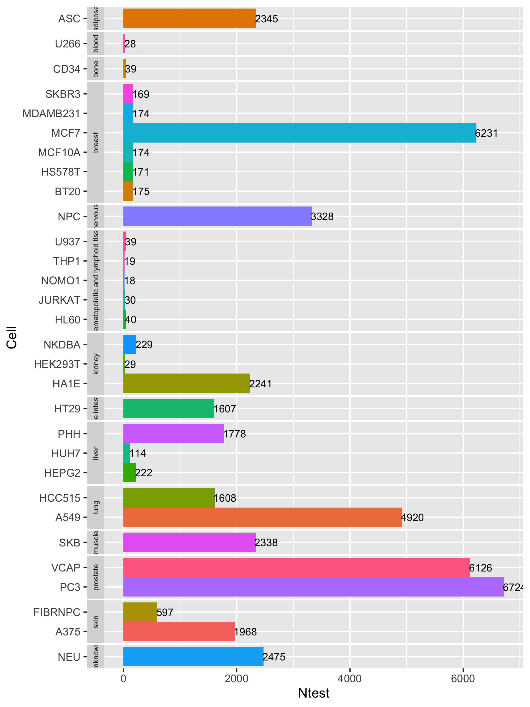

<style>
pre code, pre, code {
  white-space: pre !important;
  overflow-x: auto !important;
  word-break: keep-all !important;
  word-wrap: initial !important;
}
</style>

```{r global_options, include=FALSE, warning=FALSE}                                            
## ThG: chunk added to enable global knitr options. The below turns on 
## caching for faster vignette re-build during text editing.                                      
knitr::opts_chunk$set(cache=TRUE)                                                  
```            

```{r setup, echo=FALSE, messages=FALSE, warning=FALSE}
suppressPackageStartupMessages({
  library(signatureSearch)
  library(ggplot2)
})
```

# Introduction

## Background

The _signatureSearch_ package implements algorithms and data structures for
performing gene expression signature (GES) searches, and subsequently
interpreting the results functionally with specialized enrichment methods [@Duan2020-bj].
These utilities are useful for studying the effects of genetic, chemical and
environmental perturbations on biological systems. Specifically, in drug
discovery they can be used for identifying novel modes of action (MOA) of
bioactive compounds from reference databases such as LINCS containing the
genome-wide GESs from tens of thousands of drug and genetic perturbations
[@Subramanian2017-fu]. A typical GES search (GESS) workflow can be divided into
two major steps (Figure 1).  First, GESS methods are used to identify
perturbagens such as drugs that induce GESs similar to a query GES of interest.
The queries can be drug-, disease- or phenotype-related GESs. Since the
MOAs of most drugs in the corresponding reference databases are known, the
resulting associations are useful to gain insights into pharmacological and/or
disease mechanisms, and to develop novel drug repurposing approaches. Second,
specialized functional enrichment analysis (FEA) methods using annotations
systems, such as Gene Ontologies (GO), pathways or Disease Ontologies (DO),
have been developed and implemented in this package to efficiently interpret
GESS results. The latter are usually composed of lists of perturbagens (_e.g._
drugs) ranked by the similarity metric of the corresponding GESS method.
Finally, network reconstruction functionalities are integrated for visualizing
the final results, _e.g._ in form of drug-target networks. Figure 1 illustrates
the major steps of a typical signature search workflow. For each GESS and FEA
step, several alternative methods have been implemented in _signatureSearch_ to
allow users to choose the best possible workflow configuration for their
research application. The individual search and enrichment methods are
introduced in the corresponding sections of this vignette.

<center>

</center>

<font size="-2"> __Figure 1:__ Overview of GESS and FEA methods. GES queries
are used to search a perturbation-based GES reference database for perturbagens
such as drugs inducing GESs similar to the query. To interpret the results, the
GESS results are subjected to functional enrichment analysis (FEA) including
drug set and target set enrichment analyses (DSEA, TSEA). Both identify
functional categories (_e.g._ GO terms or KEGG pathways) over-represented in
the GESS results. Subsequently, drug-target networks are reconstructed for
visualization and interpretation. </font>

## Motivation and Design

Integrating the above described GESS and FEA methods into an R/Bioconductor
package has several advantages. First, it simplifies the development of
automated end-to-end workflows for conducting signature searches for many
application areas. Second, it consolidates an extendable number of GESS and FEA
algorithms into a single environment that allows users to choose the best
selection of methods and parameter settings for a given research question.
Third, the usage of generic data objects and classes improves maintainability
and reproducibility of the provided functionalities, while the integration with
the existing R/Bioconductor ecosystem maximizes their extensibility and
reusability for other data analysis applications. Fourth, it provides access to
several community perturbation reference databases along with options to build
custom databases with support for most common gene expression profiling
technologies (_e.g._ microarrays and RNA-Seq).  

Figure 2 illustrates the design of the package with respect to its data
containers and methods used by the individual signature search workflow steps.
Briefly, expression profiles from genome-wide gene expression profiling
technologies (_e.g._ RNA-Seq or microarrays) are used to build a reference
database stored as HDF5 file.  Commonly, a pre-built database can be used here
that is provided by the associated _signatureSearchData_ package. A search with
a query signature against a reference database is initialized by declaring all
parameter settings in a *qSig* search object. Users can choose here one of five
different search algorithms implemented by _signatureSearch_. The nature of the
query signature along with a chosen search method defines the type of
expression data used for searching. For instance, a search with a query up/down
gene set combined with the LINCS search method will be performed on sorted gene
expression scores (see left panel in Figure 1). To minimize memory requirements
and improve time performance, large reference databases are searched in batches
with user-definable chunk sizes. The search results are stored in a
*gessResult* object. The latter contains all information required to be
processed by the downstream functional enrichment analysis (FEA) methods, here
drug set and target set enrichment analysis (TSEA and DSEA) methods. The
obtained functional enrichment results are stored as *feaResult* object that
can be passed on to various drug-target network construction and visualization
methods implemented in _signatureSearch_. 

<center>

</center>

<font size="-2">__Figure 2:__ Design of _signatureSearch_. Gene expression
profiles are stored in a reference database (here HDF5 file). Prebuilt
databases for community GES collections, such as CMAP2 and LINCS, are provided
by the affiliated _signatureSearchData_ package. The GESS query parameters are
defined in a *qSig* search object where users can choose among over five GESS
methods (CMAP, LINCS, gCMAP, Fisher, and various correlation methods).
Signature search results are stored in a *gessResult* object that can be
functionally annotated with different TSEA (*dup_hyperG*, *mGSEA*, *mabs*) and
DSEA (*hyperG*, *GSEA*) methods. The enrichment results are stored as
`feaResult` object that can be used for drug target-networks analysis and
visualization.</font>

## History of GES Databases

@Lamb2006-du generated one of the first GES databases called CMAP. Initially,
it included GESs for 164 drugs screened against four mammalian cell lines
[@Lamb2006-du]. A few years later CMAP was extended to CMAP2 containing GESs
for 1,309 drugs and eight cell lines. More recently, a much larger GES database
was released by the Library of Network-Based Cellular Signatures (LINCS)
Consortium [@Subramanian2017-fu]. In its initial release, the LINCS database
contained perturbation-based GESs for 19,811 drugs tested on up to 70 cancer
and non-cancer cell lines along with genetic perturbation experiments for
several thousand genes. The number of compound dosages and time points
considered in the assays has also been increased by 10-20 fold. The CMAP/CMAP2
databases use Affymetrix Gene Chips as expression platform. To scale from a
few thousand to many hundred thousand GESs, the LINCS Consortium uses now the
more economic L1000 assay. This bead-based technology is a low cost,
high-throughput reduced representation expression profiling assay. It measures
the expression of 978 landmark genes and 80 control genes by detecting
fluorescent intensity of beads after capturing the ligation-mediated
amplification products of mRNAs [@Peck2006-rf]. The expression of 11,350
additional genes is imputed from the landmark genes by using as training data a
collection of 12,063 Affymetrix gene chips [@Edgar2002-di]. The substantial
scale-up of the LINCS project provides now many new opportunities to explore
MOAs for a large number of known drugs and experimental drug-like small
molecules. In 2020, the LINCS 2017 database is expanded to the beta release,
here refer to as LINCS2. It contains >80k perturbations and >200 cell lines and 
over 3M gene expression profiles. This represents roughly a 3-fold expansion on 
the LINCS 2017 database. The datasets can be accessed at https://clue.io/releases/data-dashboard.

## Terminology

In the following text the term Gene Expression Signatures (GESs) can be composed
of gene sets (GSs), such as the identifier sets of differentially expressed 
genes (DEGs), or various types of quantitative gene expression profiles (GEPs) 
for a subset or all genes measured by a gene expression profiling technology. 
Some publications refer with the term GES mainly to GSs, or use as extended 
terminology "qualitative and quantitative GESs" [@Chang2011-vu]. 
For clarity and consistency, this vignette defines GES as a generic term that 
comprises both GSs and GEPs [@Lamb2006-du]. This generalization is important, 
because several GESS algorithms are introduced here that depend on reference 
databases containing GSs in some and GEPs in the majority of cases generated 
with various statistical methods. To also distinguish the queries (Q) from the 
entries in the reference databases (DB), they will be referred to as GES-Q and 
GES-DB entries in general descriptions, and as GS-Q or GEP-Q, and as GS-DB or 
GEP-DB in specific cases, respectively.

Depending on the extent the expression data have been pre-processed, the following 
distinguishes four major levels, where the first three and fourth belong into the 
GEP and GS categories, respectively. These four levels are: (1) normalized 
intensity or count values from hybridization- and sequencing-based technologies, 
respectively; (2) log fold changes (LFC) usually with base 2, Z-scores or 
p-values obtained from analysis routines of DEGs; (3) rank transformed versions 
of the GEPs obtained from the results of level 1 or 2; and (4) GSs extracted 
from the highest and lowest ranks under level 3. Typically, the corresponding 
GSs are the most up- or down-regulated DEGs observed among two biological states, 
such as comparisons among untreated *vs.* drug treatment or disease state. 
The order the DEG identifier labels are stored may reflect their ranks or have no 
meaning. When unclear, the text specifies which of the four pre-processing levels 
were used along with additional relevant details.

# Getting Started

## Package Install

As Bioconductor package `signatureSearch` can be installed with the 
`BiocManager::install()` function.
```{r install, eval=FALSE}
if (!requireNamespace("BiocManager", quietly = TRUE))
    install.packages("BiocManager")
BiocManager::install("signatureSearch")
BiocManager::install("girke-lab/signatureSearch", build_vignettes=TRUE)  # Installs from github
```

Next the package needs to be loaded into a user's R session.
```{r load, eval=TRUE, message=FALSE}
library(signatureSearch)
```

The following lists essential help files and opens the vignette of the package.
```{r load_help, eval=FALSE}
library(help="signatureSearch")  # Lists package info
browseVignettes("signatureSearch")  # Opens vignette
```

## Reference Databases

The helper package _signatureSearchData_ provides access to pre-built GES
databases, including CMAP2, LINCS and LINCS2, that are stored on Bioconductor's
`ExperimentHub` as HDF5 files. Users can download these databases as follows.

```{r download_db, eval=FALSE}
library(ExperimentHub); library(rhdf5)
eh <- ExperimentHub()
cmap <- eh[["EH3223"]]; cmap_expr <- eh[["EH3224"]]
lincs <- eh[["EH3226"]]; lincs_expr <- eh[["EH3227"]]
lincs2 <- eh[["EH7297"]]
h5ls(lincs2)
```

This will store the paths to the downloaded database files in the corresponding
variables. The reference databases store the following information: (1)
`lincs` contains moderated z-scores from differential expression (DE) analysis
of 12,328 genes from 8,140 compound treatments of 30 cell lines corresponding
to a total of 45,956 signatures; (2) `lincs_expr` contains gene expression
intensity values from 5,925 compound treatments of 30 cell lines corresponding
to a total of 38,824 signatures; (3) `cmap` contains $log_2$ fold changes of
12,437 genes from 1,281 compound treatments of 5 cell lines corresponding to a
total of 3,478 signatures; (4) `cmap_expr` contains mean expression values
from 1,309 drug treatments of 4 cell lines corresponding to a total of 3,587
signatures. To minimize redundancy in the `lincs` and `lincs_expr` databases,
they were assembled from GESs corresponding to a compound dosage and treatment
time of 10$\mu$M and 24h, respectively. If necessary one can
create here easily database instances for all LINCS measurements.
However, this will make the search results overwhelmingly complex which we
wanted to avoid here; (5) `lincs2` contains moderated z-scores from DE analysis
of 12,328 genes from 30,456 compound treatments of 58 cell lines corresponding
to a total of 136,460 signatures. To minimize redundancy of perturbagens having
many signatures in different dosage and treatment time within the same cell line, 
the 'exemplar' signature for each perturbagen in each cell line was assembled.
These signatures are annotated from CLUE group and are generally picked based on 
TAS (Transcriptional Activity Score), such that the signature with the highest 
TAS is chosen as exemplar. The LINCS2 database is exactly the same as the 
reference database used for the Query Tool in CLUE website.

For details how the CMAP2, LINCS and LINCS2 databases were
constructed, please refer to the vignette of the `signatureSearchData` package.
The command `browseVignettes("signatureSearchData")` will open this vignette
from R.

Custom databases can be built with the `build_custom_db` function. Here the
user provides custom genome-wide gene expression data (_e.g._ for drug, disease
or genetic perturbations) in a `data.frame` or `matrix`. The gene expression
data can be most types of the pre-processed gene expression values described
under section 1.4. 

# Signature Searches (GESS)

This tutorial section introduces the GESS algorithms implemented in
_signatureSearch_. Currently, this includes five search algorithms, while
additional ones will be added in the future. Based on the data types
represented in the query and database, they can be classified into set- and
correlation-based methods (see Figure 1). The first 4 methods described below
are set-based, whereas the last one is a correlation-based method. We refer to
a search method as set-based if at least one of the two data components (query
and/or database) is composed of an identifier set (_e.g._ gene labels) that may
be ranked or unranked. In contrast to this, correlation-based methods require
quantitative values, usually of the same type such as normalized intensities,
for both the query and the database entries. An advantage of the set-based
methods is that their queries can be the highest and lowest ranking gene sets
derived from a genome-wide profiling technology that may differ from the one
used to generate the reference database. However, the precision of correlation
methods often outperforms set-based methods. On the other hand, due to the
nature of the expected input, correlation-based methods are usually only an
option when both the query and database entries are based on the same or at
least comparable technologies. In other words, set-based methods are more 
technology agnostic than correlation-based methods, but may not provide the 
best precision performance.


## Test Query and Database

To minimize the run time of the following test code, a small toy database has
been assembled from the LINCS database containing a total of 100 GESs from
human SKB (muscle) cells. Of the 100 GESs in this toy database, 95 were random
sampled and 5 were cherry-picked. The latter five are GESs from HDAC inhibitor
treatments including the known drugs: vorinostat, rhamnetin, trichostatin A,
pyroxamide, and HC toxin. To further reduce the size of the toy database, the
number of its genes was reduced from 12,328 to 5,000 by random sampling. The
query signature used in the sample code below is the vorinostat GES drawn from
the toy database. For simplicity and to minimize the build time of this
vignette, the following sample code uses a pre-generated instance of this toy
database stored under the `extdata` directory of this package. The
detailed code for generating the toy database and other custom instances of the
LINCS database is given in the Supplementary Material section of this vignette. 

The following imports the toy GES database into a `SummarizedExperiment` 
container (here `sample_db`). In addition, the test query set of up/down DEGs 
(here `upset` and `downset`) is extracted from the vorinostat GES entry in the 
database.

```{r db_sig, eval=TRUE, message=FALSE}
db_path <- system.file("extdata", "sample_db.h5", package = "signatureSearch")
# Load sample_db as `SummarizedExperiment` object
library(SummarizedExperiment); library(HDF5Array)
sample_db <- SummarizedExperiment(HDF5Array(db_path, name="assay"))
rownames(sample_db) <- HDF5Array(db_path, name="rownames")
colnames(sample_db) <- HDF5Array(db_path, name="colnames")
# get "vorinostat__SKB__trt_cp" signature drawn from toy database
query_mat <- as.matrix(assay(sample_db[,"vorinostat__SKB__trt_cp"]))
query <- as.numeric(query_mat); names(query) <- rownames(query_mat)
upset <- head(names(query[order(-query)]), 150)
head(upset)
downset <- tail(names(query[order(-query)]), 150)
head(downset)
```

## CMAP Search Method 

@Lamb2006-du introduced the gene expression-based search method known as
Connectivity Map (CMap) where a GES database is searched with a query GES for
similar entries [@Lamb2006-du]. Specifically, the GESS method from
@Lamb2006-du, here termed as *CMAP*, uses as query the two label sets of the
most up- and down-regulated genes from a genome-wide expression experiment,
while the reference database is composed of rank transformed expression
profiles (_e.g._ ranks of LFC or z-scores). The actual GESS algorithm is based
on a vectorized rank difference calculation. The resulting Connectivity Score
expresses to what degree the query up/down gene sets are enriched on the top
and bottom of the database entries, respectively. The search results are a list
of perturbagens such as drugs that induce similar or opposing GESs as the
query. Similar GESs suggest similar physiological effects of the corresponding
perturbagens. As discussed in the introduction, these GES associations can be
useful to uncover novel MOAs of drugs or treatments for diseases. Although
several variants of the *CMAP* algorithm are available in other software
packages including Bioconductor, the implementation provided by
`signatureSearch` follows the original description of the authors as closely as
possible. This allows to reproduce in our tests the search results from the
corresponding CMAP2 web service of the Broad Institute.

In the following code block, the `qSig` function is used to generate a `qSig`
object by defining (i) the query signature, (ii) the GESS method and (iii) the
path to the reference database. Next, the query signature is used to search the
reference database with the chosen GESS method. The type of the query signature
and the reference database needs to meet the requirement of the search
algorithm. In the chosen example the GESS method is *CMAP*, where the query
signature needs to be the labels of up and down regulated genes, and the
reference database contains rank transformed genome-wide expression profiles.
Alternatively, the database can contain the genome-wide profiles themselves. In
this case they will be transformed to gene ranks during the search. Note, in
the given example the `db_path` variable stores the path to the toy database
containing 100 GESs composed of z-scores.

```{r gess_cmap, eval=TRUE}
qsig_cmap <- qSig(query = list(upset=upset, downset=downset), 
                  gess_method="CMAP", refdb=db_path)
cmap <- gess_cmap(qSig=qsig_cmap, chunk_size=5000, workers=1, addAnnotations = TRUE)
cmap
result(cmap)
```

The search result is stored in a `gessResult` object (here named `cmap`)
containing the following components: search result table, query signature, name
of the GESS method and path to the reference database. The `result` accessor
function can be used to extract the search result table from the `gessResult`
object. This table contains the search results for each perturbagen (here
drugs) in the reference database ranked by their signature similarity to the
query. For the *CMAP* method, the similarity metrics are `raw_score` and
`scaled_score`. The raw score represents the bi-directional enrichment score
(Kolmogorov-Smirnov statistic) for a given up/down query signature. Under the
`scaled_score` column, the `raw_score` has been scaled to values from 1 to -1
by dividing positive scores and negative scores with the maximum positive score
and the absolute value of the minimum negative score, respectively. The
remaining columns in the search result table contain the following information.
`pert`: name of perturbagen (_e.g._ drug) in the reference database; `cell`:
acronym of cell type; `type`: perturbation type, _e.g._ compound treatment is
`trt_cp`; `trend`: up or down when reference signature is positively or
negatively connected with the query signature, respectively; `N_upset` or
`N_downset`: number of genes in the query up or down sets, respectively;
`t_gn_sym`: gene symbols of the corresponding drug targets.


## LINCS Search Method

@Subramanian2017-fu introduced a more complex GESS algorithm, here referred to
as *LINCS*. While related to *CMAP*, there are several important differences
among the two approaches. First, *LINCS* weights the query genes based on the
corresponding differential expression scores of the GEPs in the reference
database (_e.g._ LFC or z-scores). Thus, the reference database used by *LINCS*
needs to store the actual score values rather than their ranks. Another
relevant difference is that the *LINCS* algorithm uses a bi-directional
weighted Kolmogorov-Smirnov enrichment statistic (ES) as similarity metric. To
the best of our knowledge, the `LINCS` search functionality in
`signatureSearch` provides the first downloadable standalone software
implementation of this algorithm.

In the following example the `qSig` object for the *LINCS* method is
initialized the same way as the corresponding *CMAP* object above with the
exception that "LINCS" needs to be specified under the `gess_method` argument.

```{r gess_lincs, eval=TRUE}
qsig_lincs <- qSig(query=list(upset=upset, downset=downset), 
                   gess_method="LINCS", refdb=db_path)
lincs <- gess_lincs(qsig_lincs, sortby="NCS", tau=FALSE, workers=1, addAnnotations = TRUE)
result(lincs)
```

The `gess_*` functions also support appending the compound annotation 
table (if provided) to the GESS result for the `pert` column (`pert_id` column 
if `refdb` is set as `lincs2`) that stores compounds in the 
`drug` slot of `<drug>__<cell>__<factor>`
format of treatments in the reference database. The following uses LINCS method
searching against the newest LINCS2 database and passing the LINCS2 compound
information table as an example.
```{r gess_lincs2, eval=FALSE}
data("lincs_pert_info2")
qsig_lincs2 <- qSig(query=list(upset=upset, downset=downset), 
                   gess_method="LINCS", refdb="lincs2")
# When the compound annotation table is not provided
lincs2 <- gess_lincs(qsig_lincs2, tau=FALSE, sortby="NCS", workers=2)
# When the compound annotation table is provided
lincs2 <- gess_lincs(qsig_lincs2, tau=TRUE, sortby="NCS", workers=1,
                     cmp_annot_tb=lincs_pert_info2, by="pert_id", 
                     cmp_name_col="pert_iname") # takes about 15 minutes
result(lincs2) %>% print(width=Inf)   
```

The search results are stored in a `gessResult` object as under the _CMAP_
example above. The similarity scores stored in the _LINCS_ result table are
summarized here. `WTCS`: Weighted Connectivity Score; `WTCS_Pval`: nominal
p-value of WTCS; `WTCS_FDR`: false discovery rate of `WTCS_Pval`; `NCS`:
normalized connectivity score; `NCSct`: NCS summarized across cell types;
`Tau`: enrichment score standardized for a given database. The latter is only
included in the result table if `tau=TRUE` in a `gess_lincs` function call. The
example given is run with `tau=FALSE`, because the tau values are only
meaningful when the complete LINCS database is used which is not the case for
the toy database. `TauRefSize`: size of reference perturbations for computing Tau.

The following provides a more detailed description of the similarity scores 
computed by the _LINCS_ method. Additional details are available in the
Supplementary Material Section of the @Subramanian2017-fu paper.

`WTCS`: The Weighted Connectivity Score is a bi-directional ES for an up/down 
query set. If the ES values of an up set and a down set are of different signs, 
then WTCS is (ESup-ESdown)/2, otherwise, it is 0. WTCS values range from -1 
to 1. They are positive or negative for signatures that are positively or 
inversely related, respectively, and close to zero for signatures that are 
unrelated.

`WTCS_Pval` and `WTCS_FDR`: The nominal p-value of the WTCS and the 
corresponding false discovery rate (FDR) are computed by comparing the WTCS 
against a null distribution of WTCS values obtained from a large number of 
random queries (_e.g._ 1000).

`NCS`: To make connectivity scores comparable across cell types and
perturbation types, the scores are normalized. Given a vector of $WTCS$ values
$w$ resulting from a query, the values are normalized within each cell line $c$
and perturbagen type $t$ to obtain the Normalized Connectivity Score ($NCS$) by
dividing the $WTCS$ value by the signed mean of the $WTCS$ values within the 
subset of signatures in the reference database corresponding to $c$ and $t$.

`NCSct`: The NCS is summarized across cell types as follows. Given a vector of
$NCS$ values for perturbagen $p$, relative to query $q$, across all cell lines
$c$ in which $p$ was profiled, a cell-summarized connectivity score is obtained
using a maximum quantile statistic. It compares the 67 and 33 quantiles of
$NCSp,c$ and retains whichever is of higher absolute magnitude.

`Tau`: The standardized score Tau compares an observed $NCS$ to a large set of
$NCS$ values that have been pre-computed for a specific reference database. The
query results are scored with Tau as a standardized measure ranging from 100 to
-100. A Tau of 90 indicates that only 10% of reference perturbations exhibit 
stronger connectivity to the query. This way one can make more meaningful
comparisons across query results. 


## gCMAP Search Method

The Bioconductor *gCMAP* [@Sandmann2014-qm] package provides access to a related
but not identical implementation of the original _CMAP_ algorithm proposed by
@Lamb2006-du. It uses as query a rank transformed GEP and the reference
database is composed of the labels of up and down regulated DEG sets. This is
the opposite situation of the *CMAP* method, where the query is composed of the
labels of up and down regulated DEGs and the database contains rank transformed
GESs.

In case of the _gCMAP_ GESS method, the GEP-Q is a matrix with a single
column representing gene ranks from a biological state of interest, here
vorinostat treatment in SKB cells. The corresponding gene labels are stored in
the row name slot of the matrix.  Instead of ranks one can provide scores
(_e.g._ z-scores) as in the example given below. In such a case the scores will
be internally transformed to ranks. The reference database consists of gene
label sets that were extracted from the toy databases by applying a `higher`
and `lower` filter, here set to `1` and `-1`, respectively.

```{r gess_gcmap, eval=TRUE}
qsig_gcmap <- qSig(query = query_mat, gess_method = "gCMAP", refdb = db_path)
gcmap <- gess_gcmap(qsig_gcmap, higher=1, lower=-1, workers=1, addAnnotations = TRUE)
result(gcmap)
```

As in the other search methods, the _gCMAP_ results are stored in a
`gessResult` object. The columns in the corresponding search result table, that
are specific to the _gCMAP_ method, contain the following information. 
`effect`: scaled bi-directional enrichment score corresponding to the 
`scaled_score` under the _CMAP_ result; `nSet`: number of genes in the reference
gene sets after applying the higher and lower cutoff; `nFound`: number of genes 
in the reference gene sets that are present in the query signature; `signed`: 
whether the gene sets in the reference database have signs, _e.g._ representing 
up and down regulated genes when computing scores.

## Fisher Search Method

Fisher's exact test [@Graham_J_G_Upton1992-pg] can also be used to search a GS-DB
for entries that are similar to a GS-Q. In this case both the
query and the database are composed of gene label sets, such as DEG sets.

In the following example, both the `query` and the `refdb` used under the `qSig`
call are genome-wide GEPs, here z-scores. The actual gene sets required 
for the Fisher's exact test are obtained by setting the `higher` and `lower` 
cutoffs to 1 and -1, respectively. 

```{r gess_fisher, eval=TRUE, message=FALSE}
qsig_fisher <- qSig(query = query_mat, gess_method = "Fisher", refdb = db_path)
fisher <- gess_fisher(qSig=qsig_fisher, higher=1, lower=-1, workers=1, addAnnotations = TRUE)
result(fisher)
```

The columns in the result table specific to the _Fisher_ method include the
following information. `pval`: p-value of the Fisher's exact test; `padj`:
p-value adjusted for multiple hypothesis testing using R's `p.adjust` function
with the Benjamini & Hochberg (BH) method; `effect`: z-score based on the
standard normal distribution; `LOR`: log odds ratio.

If the `query` contains the labels of up and down regulated genes then the two 
sets can be provided as a list. Internally, they will be combined into a single
unsigned set, while the reference database is processed the same way as in the 
previous example. 

```{r gess_fisher_set, eval=FALSE, message=FALSE}
qsig_fisher2 <- qSig(query = list(upset=upset, downset=downset), 
                     gess_method = "Fisher", refdb = db_path)
fisher2 <- gess_fisher(qSig=qsig_fisher2, higher=1, lower=-1, workers=1, addAnnotations = TRUE)
result(fisher2)
```

## Correlation-based Search Method

Correlation-based similarity metrics, such as Spearman or Pearson coefficients,
can also be used as GESS methods. As non-set-based methods, they require
quantitative gene expression values for both the query and the database
entries, that usually need to be of the same type to obtain meaningful results,
such as normalized intensities or read counts from microarrays or RNA-Seq
experiments, respectively. For correlation searches to work, it is important 
that both the query and reference database contain the same type of gene 
identifiers. The expected data structure of the query is a matrix with a single 
numeric column and the gene labels (_e.g._ Entrez Gene IDs) in the row name 
slot. For convenience, the correlation-based searches can either be performed 
with the full set of genes represented in the database or a subset of them. 
The latter can be useful to focus the computation for the correlation values on 
certain genes of interest such as a DEG set or the genes in a pathway of 
interest. For comparing the performance of different GESS methods, it can also 
be advantageous to subset the genes used for a correlation-based search to same 
set used in a set-based search, such as the up/down DEGs used in a _LINCS_ GESS. 
This way the search results of correlation- and set-based methods can be more 
comparable because both are provided with equivalent information content. 

### CORall

The following example runs a correlation-based search with the Spearman method
using all genes present in the reference database. The GESs used for both the 
`query` and `refdb` are z-scores. The `gess_cor` function also supports Pearson 
and Kendall correlation coefficients by assigning the corresponding names to
the `method` argument. For details, users want to consult the help file of the 
`gess_cor` function. 

```{r gess_sp, eval=TRUE}
qsig_sp <- qSig(query=query_mat, gess_method="Cor", refdb=db_path)
sp <- gess_cor(qSig=qsig_sp, method="spearman", workers=1, addAnnotations = TRUE)
result(sp)
```

The column specific to the correlation-based search methods contains the 
following information. `cor_score`: correlation coefficient based on the method 
defined in the `gess_cor` function call.

### CORsub

To perform a correlation-based search on a subset of genes represented in the 
database, one can simply provide the chosen gene subset in the query. During the
search the database entries will be subsetted to the genes provided in the 
query signature. The given example uses a query GES that is subsetted to the 
genes with the 150 highest and lowest z-scores. 

```{r gess_spsub, eval=TRUE}
# Subset z-scores of 150 up and down gene sets from 
# "vorinostat__SKB__trt_cp" signature.
query_mat_sub <- as.matrix(query_mat[c(upset, downset),])
qsig_spsub <- qSig(query = query_mat_sub, gess_method = "Cor", refdb = db_path)
spsub <- gess_cor(qSig=qsig_spsub, method="spearman", workers=1, addAnnotations = TRUE)
result(spsub)
```

## Summary of Search Results

Although the toy database is artificially small, one can use the above search
results for a preliminary performance assessment of the different GESS methods
in ranking drugs based on known modes of action (MOA). Four of the five
cherry-picked HDAC inhibitors (vorinostat, trichostatin-a, HC-toxin,
pyroxamide) were ranked among the top 10 ranking drugs in the search results of
the LINCS, Fisher and Spearman correlation methods. If generalizable, this
result implies a promising performance of these search methods for grouping
drugs by their MOA categories. In addition, the LINCS and Spearman methods were
able to rank another HDAC inhibitor, APHA-compound-8, at the top of their
search results, indicating a better sensitivity of these two methods compared
to the other methods.

## GESS Result Visualization

The `gess_res_vis` function allows to summarize the ranking scores of selected
perturbagens for GESS results across cell types along with cell type
classifications, such as normal and tumor cells. In the following plot (Figure
3) the perturbagens are drugs (along x-axis) and the ranking scores are LINCS'
NCS values (y-axis). For each drug the NCS values are plotted for each cell
type as differently colored dots, while their shape indicates the cell type
class. Note, the code for generating the plot is not evaluated here since the
toy database used by this vignette contains only treatments for one cell type
(here SKB cells). This would result in a not very informative plot. To 
illustrate the full potential of the `gess_res_vis` function, the following 
code section applies to a search where the `vorinostat` signature was used to 
query with the `gess_lincs` method the full LINCS database. Subsequently, 
the search result is processed by the `gess_res_vis` function to generate the 
plot shown in Figure 3. 

```{r gess_vis, eval=FALSE}
vor_qsig_full <- qSig(query = list(upset=upset, downset=downset), 
                   gess_method="LINCS", refdb="lincs")
vori_res_full <- gess_lincs(qSig=vor_qsig_full, sortby="NCS", tau=TRUE)
vori_tb <- result(vori_res_full)
drugs_top10 <- unique(result(lincs)$pert)[1:10]
drugs_hdac <- c("panobinostat","mocetinostat","ISOX","scriptaid","entinostat",
      "belinostat","HDAC3-selective","tubastatin-a","tacedinaline","depudecin")
drugs = c(drugs_top10, drugs_hdac)
gess_res_vis(vori_tb, drugs = drugs, col = "NCS")
```

<center>

</center>

<font size="-2"> Figure 3: Summary of NCS scores across cell types (y-axis) for
selected drugs (x-axis). The plot shown here is based on a search result where
the vorinostat signature was used to query the entire LINCS database with 
the `gess_lincs` method. The drugs included here are the 10 top ranking drugs 
of the search result plus 10 cherry-picked drugs that are all HDAC inhibitors. 
Additional details are provided in the text of this sub-section. </font>

The `cellNtestPlot` function allows to summarize the number of
perturbagens tested in cell types along with cell type primary site information, 
such as blood or muscle. The following bar plot (Figure 4) show the number of
tested compounds (along x-axis) in 30 cell types (y-axis), the text in the strips 
show the primary sites of cells in the LINCS database. 
```{r cellntest, eval=TRUE}
# cellNtestPlot(refdb="lincs")
# ggsave("vignettes/images/lincs_cell_ntest.png", width=6, height=8)

```

<font size="-2"> Figure 4: Number of tested compounds (along x-axis) in 30 cell 
types (y-axis) in LINCS database. The text in the strips show the primary sites 
of cells. </font>

The following table shows the LINCS cell information
```{r cell_info, eval=TRUE}
data("cell_info")
library(DT)
datatable(cell_info)
```

## Batch Processing of GESSs

The above 5 GESS methods support searching reference database parallelly by 
defining the `workers` parameter, the default is 1. It means that when submitting
one query, the parallelization happens on the GES database level where one 
splits up a single query process into searching several chunks of the database 
in parallel. Multiple GES queries can also be processed sequentially or 
in parallel mode. Parallel evaluations can substantially reduce processing times. 
The parallelization techniques covered in this vignette, are based on utilities of
the `BiocParallel` and `batchtools` packages. For demonstration purposes the
following example uses a small batch query containing several GESs. First, this
batch query is processed sequentially without any parallelization using a
simple `lapply` loop. Next, the same query is processed in parallel mode using
multiple CPU cores of a single machine. The third option demonstrates how this
query can be processed in parallel mode on multiple machines of a computer
cluster with a workload management (queueing) system (_e.g._ Slurm or Torque). 

### Sequential Processing

The following processes a small toy batch query with the `LINCS` method
sequentially in an `lapply` loop. The object `batch_queries` is a list
containing the two sample GESs `q1` and `q2` that are composed of entrez gene
identifiers. The search results are written to tab-delimited tabular files under
a directory called `batch_res`. The name and path of this directory can be changed 
as needed. 

```{r lapply_parallel, eval=FALSE}
library(readr)
batch_queries <- list(q1=list(upset=c("23645", "5290"), downset=c("54957", "2767")),
                      q2=list(upset=c("27101","65083"), downset=c("5813", "84")))
refdb <- system.file("extdata", "sample_db.h5", package="signatureSearch")
gess_list <- lapply(seq_along(batch_queries), function(i){
    qsig_lincs <- qSig(query = batch_queries[[i]], 
                   gess_method="LINCS", refdb=refdb)
    lincs <- gess_lincs(qsig_lincs, sortby="NCS", tau=TRUE)
    if(!dir.exists("batch_res")){
        dir.create("batch_res")
    }
    write_tsv(result(lincs), paste0("batch_res/lincs_res_", i, ".tsv"))
    return(result(lincs))
})
```

### Parallelization with Multiple CPU Cores

The GESSs from the previous example can be accelerated by taking advantage of
multiple CPU cores available on a single computer system. The parallel
evaluation happens in the below `bplapply` loop defined by the `BiocParallel`
package. For this approach, all processing instructions are encapsulated in a
function named `f_bp` that will be executed in the `bplapply` loop. As before, the
search results are written to tab-delimited tabular files under a directory
called `batch_res`. The name and path of this directory can be changed as
needed. For more background information on this and the following
parallelization options, users want to consult the vignette of the
`BiocParallel` package.

```{r multicore, eval=FALSE}
library(BiocParallel)
f_bp <- function(i){
    qsig_lincs <- qSig(query = batch_queries[[i]], 
                   gess_method="LINCS", refdb=refdb)
    lincs <- gess_lincs(qsig_lincs, sortby="NCS", tau=TRUE)
    if(!dir.exists("batch_res")){
        dir.create("batch_res")
    }
    write_tsv(result(lincs), paste0("batch_res/lincs_res_", i, ".tsv"))
    return(result(lincs))
}
gess_list <- bplapply(seq_along(batch_queries), f_bp, BPPARAM = MulticoreParam(workers = 2))
```

### Parallelization with Multiple Computer Systems

In addition to utilizing multiple CPU cores of a single machine, one can further
accelerate the processing by taking advantage of multiple computer systems (nodes)
available on a computer cluster, where a queueing systems takes care of the
load balancing.

In the following example, `Njobs` sets the number of independent processes to
be run on the cluster, and `ncpus` defines the number of CPU cores to be used
by each process. The chosen example will run 2 processes each utilizing 4 CPU
cores. If `batch_queries` contains sufficient GESs and the corresponding computing
resources are available on a cluster, then the given example process will
utilize in total 8 CPU cores. Note, the given sample code will work on most
queueing systems as it is based on utilities from the `batchtools` package. The
latter supports template files (`*.tmpl`) for defining the run parameters of
different schedulers. To run this code, one needs to have both a `conf` file (see
`.batchtools.conf.R` samples [here](https://mllg.github.io/batchtools/)) and a
`template` file (see `*.tmpl` samples
[here](https://github.com/mllg/batchtools/tree/master/inst/templates)) for the
queueing system available on a cluster. The following example uses the sample 
`conf` and `template` files for the Slurm scheduler. 

For additional details on parallelizing computations on clusters, users want to 
consult the vignettes of the `batchtools` and `BiocParallel` packages.

```{r cluster1, eval=FALSE}
library(batchtools)
batch_queries <- list(q1=list(upset=c("23645", "5290"), downset=c("54957", "2767")),
                      q2=list(upset=c("27101","65083"), downset=c("5813", "84")))
refdb <- system.file("extdata", "sample_db.h5", package="signatureSearch")

f_bt <- function(i, batch_queries, refdb){
    library(signatureSearch)
    library(readr)
    qsig_lincs <- qSig(query = batch_queries[[i]], 
                   gess_method="LINCS", refdb=refdb)
    lincs <- gess_lincs(qsig_lincs, sortby="NCS", tau=TRUE)
    if(!dir.exists("batch_res")){
        dir.create("batch_res")
    }
    write_tsv(result(lincs), paste0("batch_res/lincs_res_", i, ".tsv"))
    return(result(lincs)) # or return()
}
```

Copy the `conf` and `template` files for Slurm to current working directory.

```{r cluster2, eval=FALSE}
file.copy(system.file("extdata", ".batchtools.conf.R", package="signatureSearch"), ".")
file.copy(system.file("extdata", "slurm.tmpl", package="signatureSearch"), ".")
```

Create the registry and submit jobs.

```{r cluster3, eval=FALSE}
reg <- makeRegistry(file.dir="reg_batch", conf.file=".batchtools.conf.R")
# reg <- loadRegistry(file.dir="reg_batch", conf.file=".batchtools.conf.R", writeable=TRUE)
Njobs <- 1:2
ids <- batchMap(fun=f_bt, Njobs, more.args = list(
          batch_queries=batch_queries, refdb=refdb))
submitJobs(ids, reg=reg, resources=list(
      partition="intel", walltime=120, ntasks=1, ncpus=4, memory=10240))
getStatus()
waitForJobs() # Wait until all jobs are completed
res1 <- loadResult(1)
unlink(c(".batchtools.conf.R", "slurm.tmpl"))
```

# Functional Enrichment (FEA)

GESS results are lists of perturbagens (here drugs) ranked by their signature
similarity to a GES-Q of interest. Interpreting these search results
with respect to the cellular networks and pathways affected by the top ranking
drugs is difficult. To overcome this challenge, the knowledge of the target
proteins of the top ranking drugs can be used to perform functional enrichment
analysis (FEA) based on community annotation systems, such as Gene Ontologies
(GO), pathways (e.g.  KEGG, Reactome), drug MOAs or Pfam domains. For this, the
ranked drug sets are converted into target gene/protein sets to perform Target
Set Enrichment Analysis (TSEA) based on a chosen annotation system.
Alternatively, the functional annotation categories of the targets can be
assigned to the drugs directly to perform Drug Set Enrichment Analysis (DSEA).
Although TSEA and DSEA are related, their enrichment results can be distinct.
This is mainly due to duplicated targets present in the test sets of the TSEA
methods, whereas the drugs in the test sets of DSEA are usually unique.
Additional reasons include differences in the universe sizes used for TSEA and
DSEA. 

Importantly, the duplications in the test sets of the TSEA are due to the fact
that many drugs share the same target proteins. Standard enrichment methods
would eliminate these duplications since they assume uniqueness in the test
sets. Removing duplications in TSEA would be inappropriate since it would erase
one of the most important pieces of information of this approach. To solve this
problem, we have developed and implemented in the `signatureSearch` package a
weighting method for duplicated targets, where the weighting is proportional to
the frequency of the targets in the test set. 

To perform TSEA and DSEA, drug-target annotations are essential. They can be
obtained from several sources, including DrugBank, ChEMBL, STITCH, and the
[Touchstone](https://clue.io/) dataset from the LINCS project [@Wishart2018-ap;
@Gaulton2017-su; @Kuhn2010-hz; @Subramanian2017-fu]. Most drug-target
annotations provide UniProt identifiers for the target proteins. They can be
mapped, if necessary via their encoding genes, to the chosen functional
annotation categories, such as GO or KEGG. To minimize bias in TSEA or DSEA,
often caused by promiscuous binders, it can be beneficial to remove drugs or
targets that bind to large numbers of distinct proteins or drugs, respectively.
To conduct TSEA and DSEA efficiently, `signatureSearch` and its helper package
`signatureSearchData` provide several convenience utilities along with
drug-target lookup resources for automating the mapping from _drug sets_ to
_target sets_ to _functional categories_.

Note, most FEA tests involving proteins in their test sets are performed on the
gene level in `signatureSearch`. This way one can avoid additional duplications
due to many-to-one relationships among proteins and their encoding genes. For
this, the corresponding functions in `signatureSearch` will usually translate
target protein sets into their encoding gene sets using identifier mapping
resources from R/Bioconductor, such as the `org.Hs.eg.db` annotation package.
Because of this as well as simplicity, the text in the vignette and help files
of this package will refer to the targets of drugs almost interchangeably as
proteins or genes, even though the former are the direct targets and the latter
only the indirect targets of drugs.  

## TSEA
The following introduces how to perform TSEA on drug-based GESS results using
as functional annotation systems GO, KEGG and Reactome pathways. 
The enrichment tests are performed with three widely used algorithms that have 
been modified in `signatureSearch` to take advantage of duplication information 
present in the test sets used for TSEA. The relevance of these target duplications 
is explained above. The specialized enrichment algorithms include *Duplication
Adjusted Hypergeometric Test* (`dup_hyperG`), *Modified Gene Set Enrichment
Analysis* (`mGSEA`) and *MeanAbs* (`mabs`).


### Hypergeometric Test

The classical hypergeometric test assumes uniqueness in its gene/protein 
test sets. Its p-value is calculated according to equation

\begin{equation}
   p=\sum_{k=x}^{n} \frac {{D \choose k}{{N-D} \choose {n-k}}}{{N \choose n}}.
\end{equation}

In case of GO term enrichment analysis the individual variables are assigned
the following components. $N$ is the total number of genes/proteins contained
in the entire annotation universe; $D$ is the number of genes annotated at a
specific GO node; $n$ is the total number of genes in the test set; and $x$ is
the number of genes in the test set annotated at a specific GO node.  To
maintain the duplication information in the test sets used for TSEA, the values
of $n$ and $x$ in the above equation are adjusted by the frequency of the
target proteins in the test set. Effectively, the approach removes the
duplications, but maintains their frequency information in form of weighting
values.

#### With GO 

The following example code uses the $n$ top ranking drugs (here $n=10$) from the
LINCS GESS result as input to the `tsea_dup_hyperG` method. Internally, the 
latter converts the drug set to a target set, and then computes for it 
enrichment scores for each MF GO term based on the hypergeometric distribution. 
The enrichment results are stored in a `feaResult` object. It contains the 
organism information of the annotation system, and the ontology type of the GO 
annotation system. If the annotation system is KEGG, the latter will be "KEGG". 
The object also stores the input drugs used for the enrichment test, as well as 
their target information. 

```{r tsea_dup_hyperG_go, eval=TRUE, message=FALSE}
drugs <- unique(result(lincs)$pert[1:10])
dup_hyperG_res <- tsea_dup_hyperG(drugs=drugs, universe="Default", 
                                  type="GO", ont="MF", pvalueCutoff=0.05, 
                                  pAdjustMethod="BH", qvalueCutoff=0.1, 
                                  minGSSize=10, maxGSSize=500)
dup_hyperG_res
```

The `result` accessor function can be used to extract a tabular result from the
`feaResult` object. The rows of this result table contain the functional
categories (_e.g._ GO terms or KEGG pathways) ranked by the corresponding
enrichment statistic. 

```{r tsea_dup_hyperG_go_result, eval=TRUE}
result(dup_hyperG_res)
```

The columns in the result table, extracted from the `feaResult` object, contain
the following information. Note, some columns are only present in the result
tables of specific FEA methods. `ont`: in case of GO one of BP, MF, CC,
or ALL; `ID`: GO or KEGG IDs; `Description`: description of functional
category; `pvalue`: raw p-value of enrichment test; `p.adjust`: p-value
adjusted for multiple hypothesis testing based on method specified under
`pAdjustMethod`; `qvalue`: q value calculated with R's `qvalue` function to
control FDR; `itemID`: IDs of items (genes for TSEA, drugs for DSEA)
overlapping among test and annotation sets;
`setSize`: size of the functional category; `GeneRatio`: ratio of genes in the
test set that are annotated at a specific GO node or KEGG pathway; `BgRatio`:
ratio of background genes that are annotated at a specific GO node or KEGG
pathway. `Count`: number of overlapped genes between the test set and the 
specific functional annotation term.

#### With KEGG 

The same enrichment test can be performed for KEGG pathways as follows.

```{r tsea_dup_hyperG_kegg, eval=TRUE, message=FALSE}
dup_hyperG_k_res <- tsea_dup_hyperG(drugs=drugs, universe="Default", type="KEGG",
                                    pvalueCutoff=0.5, pAdjustMethod="BH", qvalueCutoff=0.5,
                                    minGSSize=10, maxGSSize=500)
result(dup_hyperG_k_res)
## Mapping 'itemID' column in the FEA enrichment result table from Entrez ID to gene Symbol
set_readable(result(dup_hyperG_k_res))
```

The content of the columns extracted from the `feaResult` object is described
under section 4.1.1.1. 

#### With Reactome 

The same enrichment test can be performed for Reactome pathways as follows.

```{r tsea_dup_hyperG_reactome, eval=TRUE, message=FALSE}
dup_rct_res <- tsea_dup_hyperG(drugs=drugs, type="Reactome",
                               pvalueCutoff=0.5, qvalueCutoff=0.5, readable=TRUE)
result(dup_rct_res)
```

### mGSEA Method

The original GSEA method proposed by @Subramanian2005-ro uses predefined gene
sets $S$ defined by functional annotation systems such as GO and KEGG.  The
goal is to determine whether the genes in $S$ are randomly distributed
throughout a ranked test gene list $L$ (*e.g.* all genes ranked by LFC) or
enriched at the top or bottom of the test list. This is expressed by an
Enrichment Score ($ES$) reflecting the degree to which a set $S$ is
overrepresented at the extremes of $L$. 

For TSEA, the query is a target set where duplicated entries need to be
maintained. To perform GSEA with duplication support, here referred to as
mGSEA, the target set is transformed to a score ranked target list $L_{tar}$ of
all targets provided by the corresponding annotation system. For each target in
the query target set, its frequency is divided by the number of targets in the
target set, which is the weight of that target. For targets present in the
annotation system but absent in the target test set, their scores are set to 0.
Thus, every target in the annotation system will be assigned a score and then
sorted decreasingly to obtain $L_{tar}$.

In case of TSEA, the original GSEA method cannot be used directly since a large 
portion of zeros exists in $L_{tar}$. If the scores of the genes in set $S$ are 
all zeros, $N_R$ (sum of scores of genes in set $S$) will be zero, which cannot 
be used as the denominator. In this case, $ES$ is set to -1. If only some genes 
in set $S$ have scores of zeros then $N_R$ is set to a larger number to 
decrease the weight of the genes in $S$ that have non-zero scores.

\begin{equation}
   N_R=\sum_{g_j\in S}|r_j|^p+min(r_j | r_j > 0)*\sum_{g_j\in S}I_{r_j=0}
\end{equation}

<center>
<font size="-2"> $r_j$: score of gene $j$ in $L_{tar}$; $p=1$ </font>
</center>

The reason for this modification is that if only one gene in gene set $S$ has 
a non-zero score and this gene ranks high in $L_{tar}$, the weight of this gene 
will be 1 resulting in an $ES(S)$ close to 1. Thus, the original GSEA method 
will score the gene set $S$ as significantly enriched. However, this is 
undesirable because in this example only one gene is shared among the target 
set and the gene set $S$. Therefore, giving small weights to genes in $S$ that
have scores of zero would decrease the weight of the genes in $S$ that have 
scores other than zero, thereby decreasing the false positive rate. To favor 
truly enriched GO terms and KEGG pathways (gene set $S$) at the top of 
$L_{tar}$, only gene sets with positive $ES$ are selected. 

#### With GO

The following performs TSEA with the *mGSEA* method using the same drug test
set as in the above `tsea_dup_hyperG` function call. The arguments of the
`tsea_mGSEA` function are explained in its help file that can be opened from R
with `?tsea_mGSEA`.

```{r tsea_mgsea_go, eval=TRUE, message=FALSE}
mgsea_res <- tsea_mGSEA(drugs=drugs, type="GO", ont="MF", exponent=1, 
                        nPerm=1000, pvalueCutoff=1, minGSSize=5)
result(mgsea_res)
```

The content of the columns extracted from the `feaResult` object is described
under section 4.1.1.1. The additional columns specific to the GSEA algorithm 
are described here.

`enrichmentScore`: $ES$ from the GSEA algorithm [@Subramanian2005-ro]. The score
is calculated by walking down the gene list $L$, increasing a running-sum 
statistic when we encounter a gene in $S$ and decreasing when it is not. The 
magnitude of the increment depends on the gene scores. The $ES$ is the maximum 
deviation from zero encountered in the random walk. It corresponds to a weighted
Kolmogorov-Smirnov-like statistic.

`NES`: Normalized enrichment score. The positive and negative enrichment scores 
are normalized separately by permutating the composition of the gene list $L$ 
`nPerm` times, and dividing the enrichment score by the mean of the permutation 
$ES$ with the same sign.

`pvalue`: The nominal p-value of the $ES$ is calculated using a permutation
test.  Specifically, the composition of the gene list $L$ is permuted and the
$ES$ of the gene set is recomputed for the permutated data generating a null
distribution for the ES. The p-value of the observed $ES$ is then calculated
relative to this null distribution.

`leadingEdge`: Genes in the gene set S (functional category) that appear in the 
ranked list $L$ at, or before, the point where the running sum reaches its 
maximum deviation from zero. It can be interpreted as the core of a gene set 
that accounts for the enrichment signal.

`ledge_rank`: Ranks of genes in 'leadingEdge' in gene list $L$.

#### With KEGG 

The same enrichment test can be performed for KEGG pathways as follows.

```{r tsea_mgsea_kegg, eval=TRUE, message=FALSE}
mgsea_k_res <- tsea_mGSEA(drugs=drugs, type="KEGG", exponent=1, 
                          nPerm=1000, pvalueCutoff=1, minGSSize=2)
result(mgsea_k_res)
```

The content of the columns extracted from the `feaResult` object is described
under sections 4.1.1.1 and 4.1.2.1. 

#### With Reactome 

The same enrichment test can be performed for Reactome pathways as follows.

```{r tsea_mgsea_rct, eval=TRUE, message=FALSE}
mgsea_rct_res <- tsea_mGSEA(drugs=drugs, type="Reactome", pvalueCutoff=1,
                            readable=TRUE)
result(mgsea_rct_res)
```

### MeanAbs Method

The input for the *MeanAbs* method is $L_{tar}$, the same as for *mGSEA*. In 
this enrichment statistic, $mabs(S)$, of a gene set $S$ is calculated as mean
absolute scores of the genes in $S$ [@Fang2012-ms]. In order to adjust for size
variations in gene set $S$, 1000 random permutations of $L_{tar}$ are performed
to determine $mabs(S,\pi)$. Subsequently, $mabs(S)$ is normalized by
subtracting the median of the $mabs(S,\pi)$ and then dividing by the standard
deviation of $mabs(S,\pi)$ yielding the normalized scores $Nmabs(S)$. Finally,
the portion of $mabs(S,\pi)$ that is greater than $mabs(S)$ is used as nominal
p-value. The resulting nominal p-values are adjusted for multiple hypothesis
testing using the Benjamini-Hochberg method [@Benjamini1995-vk].

#### With GO

The following performs TSEA with the *mabs* method using the same drug test set
as the examples given under the *dup\_hyperG* and *tsea_mGSEA* sections. The 
arguments of the `tsea_mabs` function are explained in its help file that can be
opened from R with `?tsea_mabs`.

```{r tsea_mabs_go, eval=TRUE, message=FALSE}
mabs_res <- tsea_mabs(drugs=drugs, type="GO", ont="MF", nPerm=1000, 
                      pvalueCutoff=0.05, minGSSize=5)
result(mabs_res)
```

The content of the columns extracted from the `feaResult` object is explained
under section 4.1.1.1. The columns specific to the *mabs* algorithm are 
described below.

`mabs`: Given a scored ranked gene list $L$, $mabs(S)$ represents the mean 
absolute score of the genes in set $S$.

`Nmabs`: $mabs(S)$ normalized.

#### With KEGG

The same enrichment test can be performed for KEGG pathways as follows.

```{r tsea_mabs_kegg, eval=TRUE, message=FALSE}
mabs_k_res <- tsea_mabs(drugs=drugs, type="KEGG", nPerm=1000, 
                        pvalueCutoff=0.2, minGSSize=5)
result(mabs_k_res)
```

#### With Reactome

The same enrichment test can be performed for Reactome pathways as follows.

```{r tsea_mabs_rct, eval=TRUE, message=FALSE}
mabs_rct_res <- tsea_mabs(drugs=drugs, type="Reactome", pvalueCutoff=1,
                          readable=TRUE)
result(mabs_rct_res)
```

## DSEA

Instead of translating ranked lists of drugs into target sets, as for TSEA, the
functional annotation categories of the targets can be assigned to the drugs
directly to perform Drug Set Enrichment Analysis (DSEA) instead. Since the  
drug lists from GESS results are usually unique, this strategy overcomes the
duplication problem of the TSEA approach. This way classical enrichment
methods, such as GSEA or tests based on the hypergeometric distribution, can be
readily applied without major modifications to the underlying statistical
methods. As explained above, TSEA and DSEA performed with the same enrichment
statistics are not expected to generate identical results. Rather they often
complement each other's strengths and weaknesses.

### Hypergeometric Test

The following performs DSEA with `signatureSearch's` hypergeometric test
function called `dsea_hyperG` using the same drug test set as the examples
given under in the TSEA section. The arguments are explained in its help file
that can be opened from R with `?dsea_hyperG`.

#### With GO

As functional annotation system the following DSEA example uses GO.

```{r dsea_hyperG_go, eval=TRUE, message=FALSE}
drugs <- unique(result(lincs)$pert[1:10])
hyperG_res <- dsea_hyperG(drugs=drugs, type="GO", ont="MF")
result(hyperG_res)
```

#### With KEGG

The same DSEA test can be performed for KEGG pathways as follows.

```{r dsea_hyperG_kegg, eval=TRUE, message=FALSE}
hyperG_k_res <- dsea_hyperG(drugs = drugs, type = "KEGG", 
                            pvalueCutoff = 1, qvalueCutoff = 1, 
                            minGSSize = 10, maxGSSize = 2000)
result(hyperG_k_res)
```

The content of the columns extracted from the feaResult object is described
under section 4.1.1.1.

### GSEA Method

The following performs DSEA with the *GSEA* method using as test set drug
labels combined with scores. Instead of using only the drug labels in the test
set, the *GSEA* method requires the labels as well as the scores used for
ranking the drug list in the GESS result. The scores are usually the similarity
metric used to rank the results of the corresponding GESS method, here the NCS
values from the LINCS method. The arguments of the `dsea_GSEA` function are
explained in its help file that can be opened from R with `?dsea_GSEA`.

#### With GO

As functional annotation system the following DSEA example uses GO.

```{r dsea_gsea_go, eval=TRUE}
dl <- abs(result(lincs)$NCS); names(dl) <- result(lincs)$pert
dl <- dl[dl>0]
dl <- dl[!duplicated(names(dl))]
gsea_res <- dsea_GSEA(drugList=dl, type="GO", ont="MF", exponent=1, nPerm=1000,
                      pvalueCutoff=0.2, minGSSize=5)
result(gsea_res)
```

#### With KEGG

The same DSEA test can be performed for KEGG pathways as follows.

```{r dsea_gsea_kegg, eval=TRUE, message=FALSE}
gsea_k_res <- dsea_GSEA(drugList=dl, type="KEGG", exponent=1, nPerm=1000, 
                        pvalueCutoff=1, minGSSize=5)
result(gsea_k_res)
```

Since the annotation system are drug-to-functional category mappings, the 
"leadingEdge" column contains identifiers of drugs instead of targets.

## Comparing FEA Results 

The `comp_fea_res` function re-ranks the functional categories across the
different FEA methods by using the mean rank of each functional category across
the 5 FEA methods. Here the functional categories are re-ranked by their mean 
rank values in increasing order. Since the functional categories are not always 
present in all enrichment results, the mean rank of a functional category is 
corrected by an adjustment factor that is the number of enrichment result 
methods used divided by the number of occurrences of a functional category. 
For instance, if a functional category is only present in the result of one 
method, its mean rank will be increased accordingly. 
The following plots use the `pvalue` column in the result tables for this 
ranking approach. Alternative columns can be chosen under the `rank_stat` 
argument. After re-ranking only the top ranking functional categories are shown,
here 20. Their number can be changed under the `Nshow` argument. 

```{r cmp_enrich, eval=TRUE, fig.width=10.5, fig.height=5.5}
table_list = list("dup_hyperG" = result(dup_hyperG_res), 
                  "mGSEA" = result(mgsea_res), 
                  "mabs" = result(mabs_res), 
                  "hyperG" = result(hyperG_res), 
                  "GSEA" = result(gsea_res))
comp_fea_res(table_list, rank_stat="pvalue", Nshow=20)
```

<font size="-2"> Figure 5: Ranking comparison of top GO terms across FEA
methods. The dots in the plot represent the p-values of the 20 top ranking MF
GO terms (y-axis) with heat color coding according to the color gradient in the 
legend on the right. The GO terms have been ordered from the top to the bottom 
of the plot by increasing mean rank values calculated for each GO term across 
the 5 FEA methods (x-axis).</font>

```{r cmp_enrich_k, eval=TRUE, fig.width=8}
table_list = list("dup_hyperG" = result(dup_hyperG_k_res), 
                  "mGSEA" = result(mgsea_k_res), 
                  "mabs" = result(mabs_k_res), 
                  "hyperG" = result(hyperG_k_res), 
                  "GSEA" = result(gsea_k_res))
comp_fea_res(table_list, rank_stat="pvalue", Nshow=20)
```

<font size="-2"> Figure 6: Ranking comparison among top KEGG pathways across FEA
methods. The plot depicts the same information as the previous plot but using 
KEGG pathways instead of GO terms as functional annotation system. </font>

## Summary of FEA Results

The enrichment rankings of the functional categories (GO and KEGG) show a
reasonable degree of agreement among the five FEA methods. For instance, all
five showed a high degree of enrichment for histone deacetylase pathways that
are indeed targeted by one of the query drugs, here vorinostat. Since each 
method has its strengths and weaknesses, the usage of a consensus approach 
could be considered by combining the rankings of functional categories from 
all or several FEA methods.

# Drug-Target Network Visualization

Functional modules of the above GESS and FEA results can be rendered as
interactive drug-target networks using the `dtnetplot` function from
`signatureSearch`. For this, a character vector of drug names along with an
identifier of a chosen functional category are passed on to the `drugs` and
`set` arguments, respectively. The resulting plot depicts the corresponding
drug-target interaction network. Its interactive features allow the user to
zoom in and out of the network, and to select network components in the
drop-down menu located in the upper left corner of the plot.

## With GO

The following example demonstrates how to construct a drug-target network for
two GO categories that are enriched in the results obtained in the FEA section
of this vignette. This way one can visualize drug sets in the context of the
cellular networks and pathways they affect. 

Network for *NAD-dependent histone deacetylase activity* (GO:0032041)
```{r dtnet_go_0032041, eval=TRUE}
dtnetplot(drugs = drugs(dup_hyperG_res), set = "GO:0032041", ont = "MF", 
          desc="NAD-dependent histone deacetylase activity (H3-K14 specific)")
```

<font size="-2"> Figure 7: Drug-target network for *NAD-dependent histone
deacetylase activity*. The given network graph illustrates the interactions
among drugs and their target proteins in the chosen pathway. Only drugs with at
least one target protein are included. The nodes in the network represent drugs
and targets depicted as squares and circles, respectively. The interactions
among drugs and targets are indicated by non-weighted lines (yes/no
relationship). The color of the nodes is defined by the number of their
connections to other nodes. </font>

Network for *NF-kappaB binding* (GO:0051059)
```{r dtnet_go_0051059, eval=TRUE}
dtnetplot(drugs = drugs(dup_hyperG_res), set = "GO:0051059", ont = "MF", 
          desc="NF-kappaB binding")
```

<font size="-2"> Figure 8: Drug-target network for *NF-kappaB binding*. The 
details of the plot are given in the legend of Figure 7.</font>

## With KEGG

The same drug-target network plots can be rendered for KEGG pathways as follows.

Network for KEGG pathway: *Alcoholism* (hsa05034)
```{r dtnet_kegg_05034, eval=TRUE}
dtnetplot(drugs = drugs(dup_hyperG_k_res), set = "hsa05034", 
          desc="Alcoholism")
```

<font size="-2"> Figure 9: Drug-target network for *Alcoholism*. The details of
the plot are given in the legend of Figure 7.</font>

Network for KEGG pathway: *Longevity regulating pathway* (hsa04213)
```{r dtnet_kegg_04213, eval=TRUE}
dtnetplot(drugs = drugs, set = "hsa04213", 
          desc="Longevity regulating pathway - multiple species")
```

<font size="-2"> Figure 10: Drug-target network for *Longevity regulating
pathway*. The details of the plot are given in the legend of Figure 7.</font>

# Run Workflow
The `runWF` function supports running the entire GESS/FEA workflow automatically
when providing the query drug and cell type, as well as selecting the 
reference database (e.g. `lincs` or path to the custom reference database), 
defining the specific GESS and FEA methods. When the query drug and cell type
were provided, the query GES was internally drawn from the reference database. 
The N (defined by the `N_gess_drugs` argument) top ranking hits in the GESS 
tables were then used for FEA where three different annotation systems were 
used: GO Molecular Function (GO MF), GO Biological Process (GO BP) and KEGG 
pathways. 

The GESS/FEA results will be stored in a list object in R session. 
A working environment named by the use case will be created under users current 
working directory or under other directory defined by users. 
This environment contains a \code{results} folder where the GESS/FEA 
result tables were written to. The working environment also contains
a template Rmd vignette as well as a rendered HTML report, users could make
modifications on the Rmd vignette as they need and re-render it to generate 
their HTML report by running `rmarkdown::render("GESS_FEA_report.Rmd")` in R 
session or `Rscript -e "rmarkdown::render('GESS_FEA_report.Rmd')"` from bash 
commandline.
```{r runwf, eval=FALSE}
drug <- "vorinostat"; cell <- "SKB"
refdb <- system.file("extdata", "sample_db.h5", package="signatureSearch")
env_dir <- tempdir()
wf_list <- runWF(drug, cell, refdb, gess_method="LINCS", 
    fea_method="dup_hyperG", N_gess_drugs=10, env_dir=env_dir, tau=FALSE)
```

# Additional Databases

## Gene Set Databases

The GES-DB introduced above store quantitative gene expression profiles.
For the different GESS methods, these profiles are either used in their
quantitative form or converted to non-quantitative gene sets. Additionally,
_signatureSearch_ can be used to search GES databases containing gene sets, or
to use their gene set entries as queries for searching quantitative GES
databases. Two examples of gene set databases are the [Molecular signatures
database (MSigDB)](https://www.gsea-msigdb.org/gsea/msigdb/index.jsp) and the
[Gene Set Knowledgebase (GSKB)](http://ge-lab.org/#/data) [@Liberzon2011-ta; @Liberzon2015-is;
@Culhane2012-aa; @Lai2016-gh]. MSigDB contains well-annotated gene sets
representing the universe of the biological processes in human. Version 7.1
of MSigDB contains 25,724 gene sets that are divided into 8 collections.  GSKB is
a gene set database for pathway analysis in mouse [@Lai2016-gh]. It includes
more than 40,000 pathways and gene sets compiled from 40 sources, such as Gene
Ontology, KEGG, GeneSetDB, and others. The following introduces how to work with
these gene set databases in _signatureSearch_.

### Overview

_signatureSearch_ provides utilities to import gene sets in _gmt_ format from
MSigDB, GSKB and related gene set-based resources. The imported gene sets can
be used either as set-based queries or reference databases, or both. As queries
these gene sets can be used in combination with the _CMAP_, _LINCS_ or _Fisher_
GESSs.  In addition, as set databases they can be used with the _Fisher_ and
_gCMAP_ GESSs.  The following examples illustrate how to import and search
_gmt_ files in _signatureSearch_ using sample data from MSigDB and GSKB. First,
examples are provided how to use the gene sets from both resources as queries
(here Entrez IDs from human) to search the CMAP2 and LINCS databases. Next,
several examples are provided where the MSigDB and GSKB collections serve as
reference databases for queries with compatible GESS methods. 

### Gene Sets as Queries 
The _gmt_ files can be downloaded from MSigDB ([here](https://www.gsea-msigdb.org/gsea/downloads.jsp#msigdb)),
and then imported into a user's R session with the `read_gmt` function. 

```{r gmt_query, eval=FALSE}
msig <- read_gmt("msigdb.v7.1.entrez.gmt") # 25,724
db_path <- system.file("extdata", "sample_db.h5", package = "signatureSearch")
```

Subsequently, an imported gene set can be used as query for searching a reference database
with the `CMAP`, `LINCS` or `Fisher` methods. The following example is for unlabeled 
query gene sets that lack information about up- or down-regulation.

```{r gene_no_label, eval=FALSE}
gene_set <- msig[["GO_GROWTH_HORMONE_RECEPTOR_BINDING"]]
# CMAP method
cmap_qsig <- qSig(query=list(upset=gene_set), gess_method="CMAP", refdb=db_path)
cmap_res <- gess_cmap(cmap_qsig, workers=1)
# LINCS method
lincs_qsig <- qSig(query=list(upset=gene_set), gess_method="LINCS", refdb=db_path)
lincs_res <- gess_lincs(lincs_qsig, workers=1)
# Fisher methods
fisher_qsig <- qSig(query=list(upset=gene_set), gess_method="Fisher", refdb=db_path)
fisher_res <- gess_fisher(fisher_qsig, higher=1, lower=-1, workers=1)
```

Alternatively, query gene sets with up and down labels can be used as shown below.

```{r gene_label, eval=FALSE}
gene_set_up <- msig[["GSE17721_0.5H_VS_24H_POLYIC_BMDC_UP"]]
gene_set_down <- msig[["GSE17721_0.5H_VS_24H_POLYIC_BMDC_DN"]]
# CMAP method
cmap_qsig <- qSig(query=list(upset=gene_set_up, downset=gene_set_down), 
                  gess_method="CMAP", refdb=db_path)
cmap_res <- gess_cmap(cmap_qsig, workers=1)
# LINCS method
lincs_qsig <- qSig(query=list(upset=gene_set_up, downset=gene_set_down), 
                   gess_method="LINCS", refdb=db_path)
lincs_res <- gess_lincs(lincs_qsig, workers=1)
# Fisher methods
fisher_qsig <- qSig(query=list(upset=gene_set_up, downset=gene_set_down), 
                    gess_method="Fisher", refdb=db_path)
fisher_res <- gess_fisher(fisher_qsig, higher=1, lower=-1, workers=1)
```

### Gene Sets as Database
#### MSigDB
The gene sets stored in the _gmt_ file can also be used as reference database.
The following examples uses the MSigDB combined with the `gCMAP` and `Fisher`
GESS methods. For simplicity and compatibility with both GESS methods, unlabeled
gene sets are provided to the `gmt2h5` function for generating the reference database.
To cap the memory requirements, this function supports reading and writing the
gene sets in batches by defining the `by_nset` parameter. Since the example uses the
full database, the generation of the HDF5 file takes some time, but this needs to be
done only once. Please note that for the _gCMAP_ method, this is a specialty case
for the sake of having a simple gene set database that can be used for both methods. 
The _gCMAP_ method also supports labeled gene sets represented as 0, 1, -1 matrix.

```{r gn_ref, eval=FALSE}
gmt2h5(gmtfile="./msigdb.v7.1.entrez.gmt", dest_h5="./msigdb.h5", by_nset=1000, 
       overwrite=TRUE)

# gCMAP method
query_mat <- getSig(cmp="vorinostat", cell="SKB", refdb=db_path)
gcmap_qsig2 <- qSig(query=query_mat, gess_method="gCMAP", refdb="./msigdb.h5")
gcmap_res2 <- gess_gcmap(gcmap_qsig2, higher=1, workers=1, chunk_size=2000)

# Fisher method
msig <- read_gmt("msigdb.v7.1.entrez.gmt")
gene_set <- msig[["GO_GROWTH_HORMONE_RECEPTOR_BINDING"]]
fisher_qsig2 <- qSig(query=list(upset=gene_set), gess_method="Fisher", 
                    refdb="./msigdb.h5")
fisher_res2 <- gess_fisher(fisher_qsig2, higher=1, workers=1, chunk_size=2000)
```

#### GSKB 
To use the GSKB database from mouse, the corresponding _gmt_ file needs to be downloaded 
from [here](http://ge-lab.org/#/data). The following `gCMAP` GESS uses Entrez IDs from 
mouse for both the query and the reference database. Since the example uses the
full database, the generation of the HDF5 file takes some time, but this needs to be
done only once. Please note that for the _gCMAP_ method, this is a specialty case
for the sake of having a simple gene set database that can be used for both methods. 
The _gCMAP_ method also supports labeled gene sets represented as 0, 1, -1 matrix.

```{r gn_ref_mouse, eval=FALSE}
gmt2h5(gmtfile="./mGSKB_Entrez.gmt", dest_h5="./mGSKB.h5", by_nset=1000, 
       overwrite=TRUE)

# gCMAP method
## Construct a toy query (here matrix)
gskb <- read_gmt("mGSKB_Entrez.gmt") # 41,546
mgenes <- unique(unlist(gskb))
ranks <- rev(seq_along(mgenes))
mquery <- matrix(ranks, ncol=1)
rownames(mquery) <- mgenes; colnames(mquery) <- "MAKE_UP"
gcmap_qsig3 <- qSig(query=mquery, gess_method="gCMAP", 
                    refdb="./mGSKB.h5")
gcmap_res3 <- gess_gcmap(gcmap_qsig3, higher=1, workers=1, chunk_size=2000)

# Fisher method
gene_set <- gskb[["LIT_MM_HOFFMANN_PRE-BI_VS_LARGE-PRE-BII-CELL_DIFF_Entrez"]]
fisher_qsig3 <- qSig(query=list(upset=gene_set), gess_method="Fisher", 
                    refdb="./mGSKB.h5")
fisher_res3 <- gess_fisher(fisher_qsig3, higher=1, workers=1, chunk_size=2000)
```

# Supplemental Material

## Construction of Toy Database 

Access to the LINCS database is provided via the associated 
_signatureSearchData_ package hosted on Bioconductor's `ExperimentHub`. 
The following provides the code for constructing the toy database used by the 
sample code of this vignette. To save time building this vignette, the evaluated
components of its sample code use a pre-generated instance of the toy database 
that is stored in the `extdata` directory of the `signatureSearch` package. 
Thus, the following code section is not evaluated. It also serves as an example 
how to construct other custom instances of the LINCS database.
Additional details on this topic are provided in the vignette of the 
`signatureSearchData` package. 

```{r gen_toy_db, eval=FALSE}
library(rhdf5)
eh <- ExperimentHub::ExperimentHub()
lincs <- eh[["EH3226"]]
hdacs <- c("vorinostat","trichostatin-a","pyroxamide","HC-toxin","rhamnetin")
hdacs_trts <- paste(hdacs, "SKB", "trt_cp", sep="__")
all_trts <- drop(h5read(lincs, "colnames"))
# Select treatments in SKB cell and not BRD compounds
all_trts2 <- all_trts[!grepl("BRD-", all_trts) & grepl("__SKB__", all_trts)]
set.seed(11)
rand_trts <- sample(setdiff(all_trts2, hdacs_trts), 95)
toy_trts <- c(hdacs_trts, rand_trts)
library(SummarizedExperiment); library(HDF5Array)
toy_db <- SummarizedExperiment(HDF5Array(lincs, name="assay"))
rownames(toy_db) <- HDF5Array(db_path, name="rownames")
colnames(toy_db) <- HDF5Array(db_path, name="colnames")
toy_db <- round(as.matrix(assay(toy_db)[,toy_trts]),2)
set.seed(11)
gene_idx <- sample.int(nrow(toy_db),5000)
toy_db2 <- toy_db[gene_idx,]
# The sample_db is stored in the current directory of user's R session
getwd()
createEmptyH5("sample_db.h5", level=9, delete_existing=TRUE)
append2H5(toy_db2, "sample_db.h5")
h5ls("sample_db.h5")
```

# Session Info

```{r sessionInfo}
sessionInfo()
```

# Funding

This project is funded by NIH grants
[U19AG02312](https://www.longevityconsortium.org/) and
[U24AG051129](https://www.longevitygenomics.org/) awarded by the National
Institute on Aging (NIA). Subcomponents of the environment are based on methods
developed by projects funded by NSF awards ABI-1661152 and PGRP-1810468. The
High-Performance Computing (HPC) resources used for testing and optimizing the 
code of this project were funded by NIH and NSF grants 1S10OD016290-01A1 and 
MRI-1429826, respectively. 

# References
