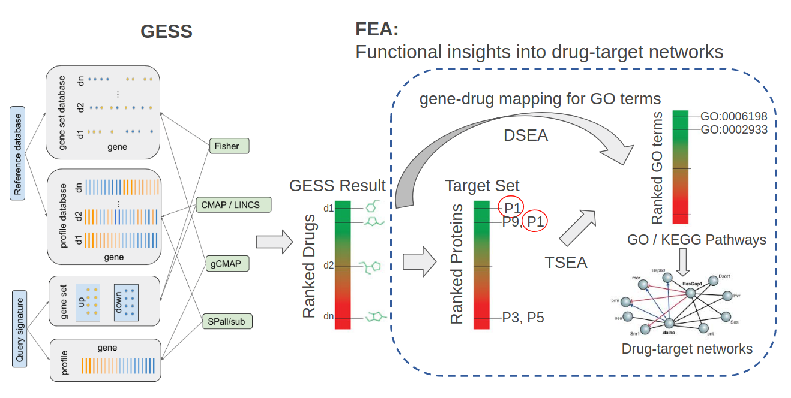
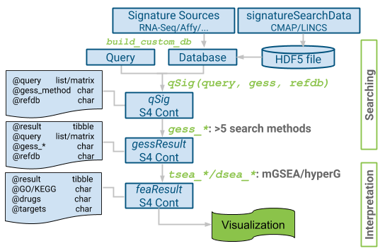
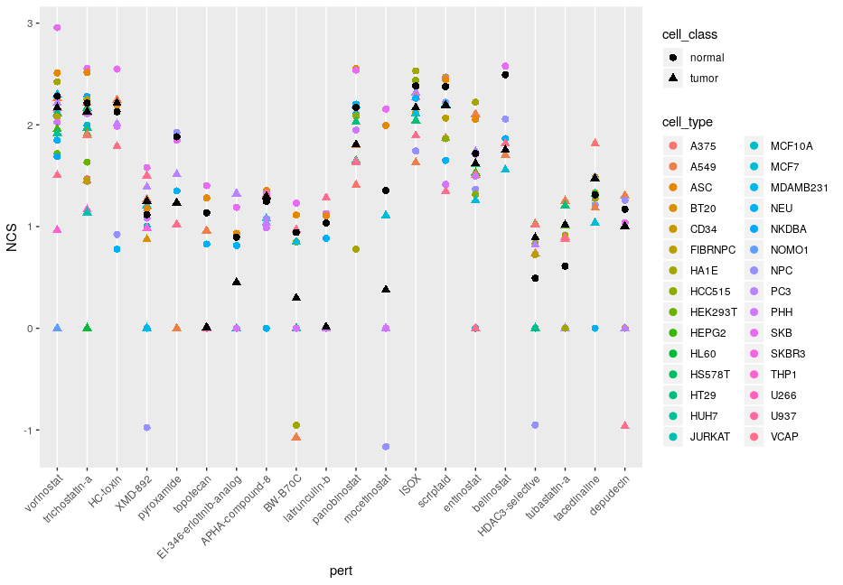

<style>
pre code, pre, code {
  white-space: pre !important;
  overflow-x: auto !important;
  word-break: keep-all !important;
  word-wrap: initial !important;
}
</style>

```{r setup0, include=FALSE}
knitr::opts_chunk$set(echo = TRUE)
options(width=200)
```

```{r setup, echo=FALSE, messages=FALSE, warnings=FALSE}
suppressPackageStartupMessages({
  library(signatureSearch)
  library(ggplot2)
})
```

# Introduction

## Background

The _signatureSearch_ package implements algorithms and data structures for
performing gene expression signature (GES) searches, and subsequently
interpreting the results functionally with specialized enrichment methods.
These utilities are useful for studying the effects of genetic, chemical and
environmental perturbations on biological systems. Specifically, in drug
discovery they can be used for identifying novel modes of action (MOA) of
bioactive compounds from reference databases such as LINCS containing the
genome-wide GESs from tens of thousands of drug and genetic perturbations
[@Subramanian2017-fu]. A typical GES search (GESS) workflow can be divided into
two major steps (Figure 1).  First, GESS methods are used to identify
perturbagens such as drugs that induce GESs similar to a query GES of interest.
The queries can be drug-, disease- or phenotype-related GESs. Since the
MOAs of most drugs in the corresponding reference databases are known, the
resulting associations are useful to gain insights into pharmacological and/or
disease mechanisms, and to develop novel drug repurposing approaches. Second,
specialized functional enrichment analysis (FEA) methods using annotations
systems, such as Gene Ontologies (GO), pathways or Disease Ontologies (DO),
have been developed and implemented in this package to efficiently interpret
GESS results. The latter are usually composed of lists of perturbagens (_e.g._
drugs) ranked by the similarity metric of the corresponding GESS method.
Finally, network resconstruction functionalities are integrated for visualizing
the final results, _e.g._ in form of drug-target networks. Figure 1 illustrates
the major steps of a typical signature search workflow. For each GESS and FEA
step, several alternative methods have been implemented in _signatureSearch_ to
allow users to choose the best possible workflow configuration for their
research application.  The individual search and enrichment methods are
introduced in the corresponding sections of this vignette.

<center>

</center>

<font size="-2"> __Figure 1:__ Overview of GESS and FEA methods. GES queries
are used to search a perturbation-based GES reference database for perturbagens
such as drugs inducing GESs similar to the query. To interpret the results, the
GESS results are subjected to functional enrichment analysis (FEA) including
drug set and target set enrichment analyses (DSEA, TSEA). Both identify
functional categories (_e.g._ GO terms or KEGG pathways) over-represented in
the GESS results. Subsequently, drug-target networks are reconstructed for
visualization and interpretation. </font> 
<font color="blue" size="-2">[ThG-Comment: under the CMAP/LINKS DB box on the
left panel it would be better to sort the colored bars in the illustration by
scores/ranks.  This would be helpful even if it is not stored this way in the
object (i.e. the sorting may be performed on the fly), as the algorithm(s)
expect the values sorted and that's what the illustration is supposed to
explain. If I remember correctly, the time performance was actually much better
if the vectors were stored in a sorted fashion but this comes with some extra
overhead for storing the label index.  Not sure what you ended up
using?]</font>

## Motivation and Design

Integrating the above described GESS and FEA methods into an R/Bioconductor
package has several advantages. First, it simplifies the development of
automated end-to-end workflows for conducting signature searches for many
application areas. Second, it consolidates an extendable number of GESS and FEA
algorithms into a single environment that allows users to choose the best
selection of methods and parameter settings for a given research question.
Third, the usage of generic data objects and classes improves maintainability
and reproducibility of the provided functionalities, while the integration with
the existing R/Bioconductor ecosystem maximizes their extensibility and
reusability for other data analysis applications. Fourth, it provides access to
several community perturbation reference databases along with options to build
custom databases with support for most common gene expression profiling
technologies (_e.g._ microarrays and RNA-Seq).  

Figure 2 illustrates the design of the package with respect to its data
containers and methods used by the individual signature search workflow steps.
Briefly, expression profiles from genome-wide gene expression profiling
technologies (_e.g._ RNA-Seq or microarrays) are used to build a reference
database stored as HDF5 file.  Commonly, a pre-built database can be used here
that is provided by the associated _signatureSearchData_ package. A search with
a query signature against a reference database is initialized by declaring all
parameter settings in a *qSig* search object. Users can choose here one of five
different search algorithms implemented by _signatureSearch_. The nature of the
query signature along with a chosen search method defines the type of
expression data used for searching. For instance, a search with a query up/down
gene set combined with the LINCS search method will be performed on sorted gene
expression scores (see left panel in Figure 1). To minimize memory requirements
and improve time performance, large reference databases are searched in batches
with user-definable chunk sizes. The search results are stored in a
*gessResult* object. The latter contains all information required to be
processed by the downstream functional enrichment analysis (FEA) methods, here
drug set and target set enrichment analysis (TSEA and DSEA) methods. The
obtained functional enrichment results are stored as *feaResult* object that
can be passed on to various drug-target network construction and visualization
methods implemented in _signatureSearch_. 

<center>

</center>

<font size="-2">__Figure 2:__ Design of _signatureSearch_. Gene expression
profiles are stored in a reference database (here HDF5 file). Prebuilt
databases for community GES collections, such as CMAP2 and LINCS, are provided
by the affiliated _signatureSearchData_ package. The GESS query parameters are
defined in a *qSig* search object where users can choose among over five GESS
methods (CMAP, LINCS, gCMAP, Fisher, and various correlation methods).
Signature search results are stored in a *gessResult* object that can be
functionally annotated with different TSEA (*dup_hyperG*, *mGSEA*, *mabs*) and
DSEA (*hyperG*, *GSEA*) methods. The enrichment results are stored as
`feaResult` object that can be used for drug target-networks analysis and
visualization.</font>

## History of GES Databases

@Lamb2006-du generated one of the first GES databases called CMAP. Initially,
it included GESs for 164 drugs screened against four mammalian cell lines
[@Lamb2006-du].  A few years later CMAP was extended to CMAP2 containing GESs
for 1,309 drugs and eight cell lines. More recently, a much larger GES database
was released by the Library of Network-Based Cellular Signatures (LINCS)
Consortium [@Subramanian2017-fu]. In its initial release, the LINCS database
contained perturbation-based GESs for 19,811 drugs tested on up to 70 cancer
and non-cancer cell lines along with genetic perturbation experiments for
several thousand genes. The number of compound dosages and time points
considered in the assays has also been increased by 10-20 fold. The CMAP/CMAP2
databases use Affymetrix Gene Chips as expression platform. To scale from a
few thousand to many hundred thousand GESs, the LINCS Consortium uses now the
more economic L1000 assay. This bead-based technology is a low cost,
high-throughput reduced representation expression profiling assay. It measures
the expression of 978 landmark genes and 80 control genes by detecting
fluorescent intensity of beads after capturing the ligation-mediated
amplification products of mRNAs [@Peck2006-rf]. The expression of 11,350
additional genes is imputed from the landmark genes by using as training data a
collection of 12,063 Affymetrix gene chips [@Edgar2002-di]. The substantial
scale-up of the LINCS project provides now many new opportunities to explore
MOAs for a large number of known drugs and experimental drug-like small
molecules.

## Terminology

In the following text the term Gene Expression Signatures (GESs) can refer to
at least four different situations of pre-processed gene expression data: (1)
normalized gene expression intensity values (or counts for RNA-Seq); (2)
$log_2$ fold changes (LFC), z-scores or p-values obtained from analysis
routines of differentially expressed genes (DEGs); (3) rank transformed
versions of the expression values obtained under (1) and (2); and (4) gene
identifier sets extracted from the top and lowest ranks under (3), such as 
`n` top up/down regulated DEGs. When unclear the text in this vignette specifies 
which of the four pre-processing states are used and/or the term GES refers to.

# Getting Started

## Package Install

As Bioconductor package `signatureSearch` can be installed with the 
`BiocManager::install()` function.
```{r install, eval=FALSE}
if (!requireNamespace("BiocManager", quietly = TRUE))
    install.packages("BiocManager")
BiocManager::install("signatureSearch", version = "3.9")
```

Next the package needs to be loaded into a user's R session.
```{r load, eval=TRUE}
library(signatureSearch)
```

## Reference Databases

The helper package _signatureSearchData_ provides access to pre-built GES
databases, including CMAP2 and LINCS, that are stored on Bioconductor's
`AnnotationHub` as HDF5 files. Users can download these databases as follows.

```{r download_db, eval=FALSE}
library(AnnotationHub); library(rhdf5)
ah <- AnnotationHub()
cmap <- ah[["AH69090"]]; cmap_expr <- ah[["AH69091"]]
lincs <- ah[["AH69092"]]; lincs_expr <- ah[["AH69093"]]
h5ls(lincs)
```

This will store the paths to the downloaded database files in the corresponding
variables. The reference databases store the following information: (1)
`lincs` contains moderated z-scores from differential expression (DE) analysis
of 12,328 genes from 8,140 compound treatments of 30 cell lines corresponding
to a total of 45,956 signatures;  (2) `lincs_expr` contains gene expression
intensity values from 5,925 compound treatments of 30 cell lines corresponding
to a total of 38,824 signatures; (3) `cmap` contains $log_2$ fold changes of
12,437 genes from 1,281 compound treatments of 5 cell lines corresponding to a
total of 3,478 signatures; and (4) `cmap_expr` contains mean expression values
from 1,309 drug treatments of 4 cell lines corresponding to a total of 3,587
signatures. To minimize redundancy in the `lincs` and `lincs_expr` databases,
they were assembled from GESs corresponding to a compound dosage and treatment
time of 10µM and 24h, respectively. If necessary one can
create here easily database instances for all LINCS measurements.
However, this will make the search results overwhelmingly complex which we
wanted to avoid here. For details how the CMAP2 and LINCS databases were
constructed, please refer to the vignette of the `signatureSearchData` package.
The command `browseVignettes("signatureSearchData")` will open this vignette
from R.

Custom databases can be built with the `build_custom_db` function. Here the
user provides custom genome-wide gene expression data (_e.g._ for drug, disease
or genetic perturbations) in a `data.frame` or `matrix`. The gene expression
data can be most types of the pre-processed gene expression values described
under section 1.4. 

# GESS Methods

This tutorial section introduces the GESS algorithms implemented in
_signatureSearch_. Currently, this includes five search algorithms, while
additional ones will be added in the future. Based on the data types
represented in the query and database, they can be classified into set- and
correlation-based methods (see Figure 1). The first 4 methods described below
are set-based, whereas the last one is a correlation-based method. We refer to
a search method as set-based if at least one of the two data components (query
and/or database) is composed of an identifier set (_e.g._ gene labels) that may
be ranked or unranked. In contrast to this, correlation-based methods require
quantitative values, usually of the same type such as normalized intensities,
for both the query and the database entries.  An advantage of the set-based
methods is that their queries can be the highest and lowest ranking gene sets
derived from a genome-wide profiling technology that may differ from the one
used to generate the reference database. However, the precision of correlation
methods often outperforms set-based methods. On the other hand, due to the
nature of the expected input, correlation-based methods are usually only an
option when both the query and database entries are based on the same or at
least comparable technologies. In other words, set-based methods are more 
technology agnostic than correlation-based methods, but may not provide the 
best precision performance.


## Test Query and Database

To minimize the run time of the following test code, a small toy database has
been assembled from the LINCS database containing a total of 100 GESs from
human SKB (muscle) cells. Of the 100 GESs in this toy database, 95 were random
sampled and 5 were cherry-picked. The latter five are GESs from HDAC inhibitor
treatments including the known drugs: vorinostat, rhamnetin, trichostatin A,
pyroxamide, and HC toxin. To further reduce the size of the toy database, the
number of its genes was reduced from 12,328 to 5,000 by random sampling. The
query signature used in the sample code below is the vorinostat GES drawn from
the toy database. For simplicity and to minimize the build time of this
vignette, the following sample code uses a pre-generated instance of this toy
database stored under the `extdata` directory of this package. The
detailed code for generating the toy database and other custom instances of the
LINCS database is given in the Supplementary Material section of this vignette. 

The following imports the toy GES database into a `SummarizedExperiment` container 
(here `sample_db`). In addition, the test query set of up/down DEGs (here `upset` and 
`downset`) is extracted from the vorinostat GES entry in the database.

```{r db_sig, eval=TRUE}
db_path <- system.file("extdata", "sample_db.h5", package = "signatureSearch")
# Load sample_db as `SummarizedExperiment` object
sample_db <- signatureSearchData::readHDF5chunk(db_path, colindex=1:100)
# get "vorinostat__SKB__trt_cp" signature drawn from sample database
query_mat <- as.matrix(assay(sample_db[,"vorinostat__SKB__trt_cp"]))
query = as.numeric(query_mat); names(query) = rownames(query_mat)
upset <- head(names(query[order(-query)]), 150)
downset <- tail(names(query[order(-query)]), 150)
```

## CMAP Search Method 

@Lamb2006-du introduced the gene expression-based search method known as
Connectivity Map (CMap) where a GES database is searched with a query GES for
similar entries [@Lamb2006-du]. Specifically, the GESS method from
@Lamb2006-du, here termed as *CMAP*, uses as query the two label sets of the
most up- and down-regulated genes from a genome-wide expression experiment,
while the reference database is composed of rank transformed expression
profiles (_e.g._ ranks of LFC or z-scores). The actual GESS algorithm is based
on a vectorized rank difference calculation. The resulting Connectivity Score
expresses to what degree the query up/down gene sets are enriched on the top
and bottom of the database entries, respectively. The search results are a list
of perturbagens such as drugs that induce similar or opposing GESs as the
query. Similar GESs suggest similar physiological effects of the corresponding
perturbagens. As discussed in the introduction, these GES associations can be
useful to uncover novel MOAs of drugs or treatments for diseases. Although
several variants of the *CMAP* algorithm are available in other software packages
including Bioconductor, the implementation provided by `signatureSearch`
follows the original description of the authors as closely as possible. This
allows to reproduce in our tests the search results from the corresponding
CMAP2 web service of the Broad Institute.

In the following code block, the `qSig` function is used to generate a `qSig`
object by defining (i) the query signature, (ii) the GESS method and (iii) the
path to the reference database. Next, the query signature is used to search the
reference database with the chosen GESS method. The type of the query signature
and the reference database needs to meet the requirement of the search
algorithm. In the chosen example the GESS method is *CMAP*, where the query
signature needs to be the labels of up and down regulated genes, and the
reference database contains rank transformed genome-wide expression profiles.
Alternatively, the database can contain the genome-wide profiles themselves. In
this case they will be transformed to gene ranks during the search. Note, in
the given example the `db_path` variable stores the path to the toy database
containing 100 GESs composed of z-scores.

```{r gess_cmap, eval=TRUE}
qsig_cmap <- qSig(query = list(upset=upset, downset=downset), 
                  gess_method="CMAP", refdb=db_path)
cmap <- gess_cmap(qSig=qsig_cmap, chunk_size=5000)
cmap
result(cmap)
```

<font color="blue">[ThG-Comment: note the help file for the the qSig
method (?qSig) is incomplete, e.g. it lacks an explicit description of the `query` 
argument.]</font>

The search result is stored in a `gessResult` object (here named `cmap`)
containing the following components: search result table, query signature, name
of the GESS method and path to the reference database. The `result` accessor
function can be used to extract the search result table from the `gessResult`
object.  This table contains the search results for each perturbagen (here
drugs) in the reference database ranked by their signature similarity to the
query. For the *CMAP* method, the similarity metrics are `raw_score` and
`scaled_score`. The raw score represents the bi-directional enrichment score
(Kolmogorov-Smirnov statistic) for a given up/down query signature. Under the
`scaled_score` column, the `raw_score` has been scaled to values from 1 to -1
by dividing positive scores and negative scores with the maximum positive score
and the absolute value of the minimum negative score, respectively. The
remaining columns in the search result table contain the following information.
`pert`: name of perturbagen (_e.g._ drug) in the reference database; `cell`:
acronym of cell type; `type`: perturbation type, _e.g._ compound treatment is
`trt_cp`; `trend`: up or down when reference signature is positively or
negatively connected with the query signature, respectively; `N_upset` or
`N_downset`: number of genes in the query up or down sets, respectively;
`t_gn_sym`: gene symbols of the corresponding drug targets.


## LINCS Search Method

@Subramanian2017-fu introduced a more complex GESS algorithm, here referred to
as *LINCS*. While related to *CMAP*, there are several important differences
among the two approaches. First, *LINCS* weights the query genes based on the
corresponding differential expression scores of the GESs in the reference database
(_e.g._ LFC or z-scores). Thus, the reference database used by *LINCS* needs
to store the actual score values rather than their ranks. Another relevant
difference is that the *LINCS* algorithm uses a bi-directional weighted
Kolmogorov-Smirnov enrichment statistic (ES) as similarity metric. To the best
of our knowledge, the `LINCS` search functionality in `signatureSearch` provides the
first downloadable standalone software implementation of this algorithm.

In the following example the `qSig` object for the *LINCS* method is
initialized the same way as the corresponding *CMAP* object above with the
exception that "LINCS" needs to be specified under the `gess_method` argument.

```{r gess_lincs, eval=TRUE}
qsig_lincs <- qSig(query = list(upset=upset, downset=downset), 
                   gess_method="LINCS", refdb=db_path)
lincs <- gess_lincs(qsig_lincs, sortby="NCS", tau=FALSE)
result(lincs)
```

The search results are stored in a `gessResult` object as under the _CMAP_
example above. The similarity scores stored in the _LINCS_ result table are
summarized here. `WTCS`: Weighted Connectivity Score; `WTCS_Pval`: nominal
p-value of WTCS; `WTCS_FDR`: false discovery rate of `WTCS_Pval`; `NCS`:
normalized connectivity score; `NCSct`: NCS summarized across cell types;
`Tau`: enrichment score standardized for a given database. The latter is only
included in the result table if `tau=TRUE` in a `gess_lincs` function call. The
example given is run with `tau=FALSE`, because the tau values are only
meaningful when the complete LINCS database is used which is not the case for
the toy database.  

The following provides a more detailed description of the similarity scores 
computed by the _LINCS_ method. Additional details are available in the Supplementary
Material Section of the @Subramanian2017-fu paper.

`WTCS`: The Weighted Connectivity Score is a bi-directional ES for an up/down query 
set. If the ES values of an up set and a down set are of different signs, then 
WTCS is (ESup-ESdown)/2, otherwise, it is 0. WTCS values range from -1 to 1. They 
are positive or negative for signatures that are positively or inversely
related, respectively, and close to zero for signatures that are unrelated.

`WTCS_Pval` and `WTCS_FDR`: The nominal p-value of the WTCS and the corresponding
false discovery rate (FDR) are computed by comparing the WTCS against a null
distribution of WTCS values obtained from a large number of random queries
(_e.g._ 1000).

`NCS`: To make connectivity scores comparable across cell types and
perturbation types, the scores are normalized. Given a vector of $WTCS$ values
$w$ resulting from a query, the values are normalized within each cell line $c$
and perturbagen type $t$ to obtain the Normalized Connectivity Score ($NCS$) by
dividing the $WTCS$ value by the signed mean of the $WTCS$ values within the subset
of signatures in the reference database corresponding to $c$ and $t$.

`NCSct`: The NCS is summarized across cell types as follows. Given a vector of
$NCS$ values for perturbagen $p$, relative to query $q$, across all cell lines
$c$ in which $p$ was profiled, a cell-summarized connectivity score is obtained
using a maximum quantile statistic. It compares the 67 and 33 quantiles of
$NCSp,c$ and retains whichever is of higher absolute magnitude.

`Tau`: The standardized score Tau compares an observed $NCS$ to a large set of
$NCS$ values that have been pre-computed for a specific reference database. The
query results are scored with Tau as a standardized measure ranging from 100 to
-100. A Tau of 90 indicates that only 10% of reference perturbations exhibit 
stronger connectivity to the query. This way one can make more meaningful
comparisons across query results. 


## gCMAP Search Method

The Bioconductor *gCMAP* [@Sandmann2014-qm] package provides access to a related but not
identical implementation of the original _CMAP_ algorithm proposed by
@Lamb2006-du. It uses as query a rank transformed GES and the reference
database is composed of the labels of up and down regulated DEG sets. This is
the opposite situation of the *CMAP* method, where the query is composed of the
labels of up and down regulated DEGs and the database contains rank transformed
GESs.

In case of the _gCMAP_ GESS method, the query GES is a matrix with a single
column representing gene ranks from a biological state of interest, here
vorinostat treatment in SKB cells. The corresponding gene labels are stored in
the row name slot of the matrix.  Instead of ranks one can provide scores
(_e.g._ z-scores) as in the example given below. In such a case the scores will
be internally transformed to ranks. The reference database consists of gene
label sets that were extracted from the toy databases by applying a `higher`
and `lower` filter, here set to `1` and `-1`, respectively.

```{r gess_gcmap, eval=TRUE}
qsig_gcmap <- qSig(query = query_mat, gess_method = "gCMAP", refdb = db_path)
gcmap <- gess_gcmap(qsig_gcmap, higher=1, lower=-1)
result(gcmap)
```

As in the other search methods, the _gCMAP_ results are stored in a
`gessResult` object. The columns in the corresponding search result table, that
are specific to the _gCMAP_ method, contain the following information. `effect`: scaled
bi-directional enrichment score corresponding to the `scaled_score` under the
_CMAP_ result; `nSet`: number of genes in the reference gene sets after
applying the higher and lower cutoff; `nFound`: number of genes in the
reference gene sets that are present in the query signature; `signed`: whether
the gene sets in the reference database have signs, _e.g._ representing up and
down regulated genes when computing scores.

## Fisher Search Method

Fisher's exact test [@Graham_J_G_Upton1992-pg] can also be used to search a GES
databases for entries that are similar to a query GES. In this case both the
query and the database are composed of gene label sets, such as DEG sets.

In the following example, both the `query` and the `refdb` used under the `qSig` 
call are genome-wide signatures, here z-scores. The actual gene sets required for
the Fisher's exact test are obtained by setting the `higher` and `lower` cutoffs
to 1 and -1, respectively.

```{r gess_fisher, eval=TRUE}
qsig_fisher <- qSig(query = query_mat, gess_method = "Fisher", refdb = db_path)
fisher <- gess_fisher(qSig=qsig_fisher, higher=1, lower=-1)
result(fisher)
```

The columns in the result table specific to the _Fisher_ method include the
following information.  `pval`: p-value of the Fisher's exact test; `padj`:
p-value adjusted for multiple hypothesis testing using R's `p.adjust` function
with the Benjamini & Hochberg (BH) method; `effect`: z-score based on the
standard normal distribution; `LOR`: log odds ratio.

<font color="blue">[ThG-Comment: note in the above qSig call it is not clear whether and
how one can provide under the query argument a gene id label set rather than a matrix
of scores. When a matrix is provided you also need to mention here and in the help
file how it is converted to a gene set. One can guess that this is done the same way
as for the database but it should be explained.]</font>

## Correlation-based Search Method

Correlation-based similarity metrics, such as Spearman or Pearson coefficients,
can also be used as GESS methods. As non-set-based methods, they require
quantitative gene expression values for both the query and the database
entries, that usually need to be of the same type to obtain meaningful results,
such as normalized intensities or read counts from microarrays or RNA-Seq
experiments, respectively. For correlation searches to work, it is important that
both the query and reference database contain the same type of gene identifiers. 
The expected data structure of the query is a matrix with a single numeric column and the
gene labels (_e.g._ Entrez Gene IDs) in the row name slot. For convenience,
the correlation-based searches can either be performed with the full set of genes
represented in the database or a subset of them. The latter can be useful
to focus the computation for the correlation values on certain genes of interest
such as a DEG set or the genes in a pathway of interest. For comparing the performance of 
different GESS methods, it can also be advantageous to subset the genes 
used for a correlation-based search to same set used in a set-based search,
such as the up/down DEGs used in a _LINCS_ GESS. This way the search results of 
correlation- and set-based methods can be more comparable because both are provided
with equivalent information content. 

### CORall

The following example runs a correlation-based search with the Spearman method
using all genes present in the reference database. The GESs used for both the 
`query` and `refdb` are z-scores. The `gess_cor` function also supports Pearson 
and Kendall correlation coefficients by assigning the corresponding names to
the `method` argument. For details, users want to consult the help file of the 
`gess_cor` function. 

```{r gess_sp, eval=TRUE}
qsig_sp <- qSig(query = query_mat, gess_method = "Cor", refdb = db_path)
sp <- gess_cor(qSig=qsig_sp, method="spearman")
result(sp)
```

The column specific to the correlation-based search methods contains the following 
information. `cor_score`: correlation coefficient based on the method defined in 
the `gess_cor` function call.

### CORsub

To perform a correlation-based search on a subset of genes represented in the 
database, one can simply provide the chosen gene subset in the query. During the
search the database entries will be subsetted to the genes provided in the 
query signature. The given example uses a query GES that is subsetted to the 
genes with the 150 highest and lowest z-scores. 

```{r gess_spsub, eval=TRUE}
# Subset z-scores of 150 up and down gene sets from 
# "vorinostat__SKB__trt_cp" signature.
query_mat_sub <- as.matrix(query_mat[c(upset, downset),])
qsig_spsub <- qSig(query = query_mat_sub, gess_method = "Cor", refdb = db_path)
spsub <- gess_cor(qSig=qsig_spsub, method="spearman")
result(spsub)
```

<font color="blue">[ThG-Comment: note in the text I have changed SPall/SPsub to
CORall/CORsub. Unless there is a reason to use SP, I find COR more intuitive
since SP implies the method is limited to Spearman which isn't and shouldn't
be the case.]</font>

## Summary of Search Results

Although the toy database is artificially small, one can still use the above
search results for a preliminary performance assessment of the different GESS
methods in ranking drugs based on known modes of action (MOA). Four of the five
cherry-picked HDAC inhibitors (vorinostat, trichostatin-a, HC-toxin,
pyroxamide) were ranked among the top 10 ranking drugs in the search results of
the LINCS, Fisher and Spearman correlation methods. If generalizable, this
result implies a promising performance of these search methods for grouping
drugs by their MOA categories. In addition, the LINCS and Spearman methods were
able to rank another HDAC inhibitor, APHA-compound-8, at the top of their search
results, indicating a better sensitivity of these two methods compared to the
other methods.

## GESS result visualization

If the reference database contains perturbations (_e.g._ drugs) of different cell 
types, including normal and tumor cell classifications, the GESS result can be 
visualized by summarizing rankings/scores of selected drugs across difference cells. The sample databases 
used in this vignette only contains treatments in SKB cell, so there is no need 
to summarize the result. I used the same `vorinostat` query signature to search 
against the full LINCS database via `gess_lincs` method, then use `gess_res_vis`
function to visualize the GESS result (Figure 3).

<center>

</center>

<font size="-2"> Figure 3: Summary of NCS scores across cell types of selected 
drugs in vorinostat GESS result searching against LINCS database. Drugs 1 to 10 
from left to right: top 10 drugs in the above search result against the toy
database with *LINCS* method. The other drugs are HDAC inhibitors not selected 
in the toy database. </font>

<font color="blue">[ThG-Comment: This section needs to include the code for
generating the plot. You don't need to evaluate the code to show this more
interesting example that depends on a more complete search result. Just state
in the text that the plot is based on such a search. Also, the text above and the
text in the corresponding gess_res_vis help file are not clear enough to understand 
what is plotted here. For instance, what does each dot represent, e.g. a single NCS 
value, an average or something else? In the legend of the plot you may want to 
change the subtitle on the top of the right side from "cell" to "cell_type" and 
in the one below from "cell_type" to "cell_class".]</font>


# FEA

GESS results are lists of drugs ranked by their signature similarity to a
query signature of interest. Interpreting these search results with respect to
the cellular networks and pathways affected by the top ranking drugs is
difficult. To overcome this challenge, the knowledge of the target proteins of
the top ranking drugs can be used to perform functional enrichment analysis
(FEA) based on community annotation systems, such as Gene Ontologies (GO),
pathways (e.g.  KEGG, Reactome), drug MOAs or Pfam domains. For this, the ranked
drug sets are converted into target gene/protein sets to perform Target Set
Enrichment Analysis (TSEA) based on a chosen annotation system. Alternatively,
the functional annotation categories of the targets can be assigned to the
drugs directly to perform Drug Set Enrichment Analysis (DSEA). Although TSEA
and DSEA are related, their enrichment results can be distinct. This is mainly
due to duplicated targets present in the test sets of the TSEA methods, whereas
the drugs in the test sets of DSEA are usually unique. Additional reasons include
differences in the universe sizes used for TSEA and DSEA. 

Importantly, the duplications in the test sets of the TSEA are due to the fact
that many drugs share the same target proteins. Standard enrichment methods
would eliminate these duplications since they assume uniqueness in the test
sets. Removing duplications in TSEA would be inappropriate since it would erase
one of the most important pieces of information of this approach. To solve this
problem, we have developed and implemented in the `signatureSearch` package a
weighting method for duplicated targets, where the weighting is proportional to
the frequency of the targets in the test set. 

To perform TSEA and DSEA, drug-target annotations are essential. They can be
obtained from several sources, including DrugBank, ChEMBL, STITCH, and the
[Touchstone](https://clue.io/) dataset from the LINCS project [@Wishart2018-ap;
@Gaulton2017-su; @Kuhn2010-hz; @Subramanian2017-fu]. Most drug-target
annotations provide UniProt identifiers for the target proteins. They can be
mapped, if necessary via their encoding genes, to the chosen functional
annotation categories, such as GO or KEGG. To minimize bias in TSEA or DSEA,
often caused by promiscuous binders, it can be beneficial to remove drugs or
targets that bind to large numbers of distinct proteins or drugs, respectively.
To conduct TSEA and DSEA efficiently, `signatureSearch` and its helper package
`signatureSearchData` provide several convenience utilities along with
drug-target lookup resources for automating the mapping from _drug sets_ to
_target sets_ to _functional categories_.

<font color="blue">[ThG-Comment: I am wondering whether we should limit the
drug-target mapping resources provided by the data package to the most reliable
and maintainable one(s), e.g. DrugBank and/or ChEMBL. Especially, including
STITCH seems questionable and redundant. I also don't like STITCH's predicted
drug-target associations. If necessary the same could be obtained from ChEMBL.
Based on the sample code in the vignette, it is also not clear why you have
discussed STITCH here. I don't see it being used which is confusing for readers, 
but perhaps I have missed it?]
</font>

## TSEA
The following introduces how to perform TSEA on drug-based GESS results using
as functional annotation systems GO and KEGG pathways. The enrichment tests are
performed with three widely used algorithms that have been modified in
`signatureSearch` to take advantage of duplication information present in the
test sets used for TSEA. The source and importance of these target duplications
is explained above. The specialized enrichment algorithms include *Duplication
Adjusted Hypergeometric Test* (`dup_hyperG`), *Modified Gene Set Enrichment
Analysis* (`mGSEA`) and *MeanAbs* (`mabs`).


### Hypergeometric Test

The classical hypergeometric test assumes uniqueness in its gene/protein 
test sets. Its p-value is calculated according to equation

\begin{equation}
   p=\sum_{k=x}^{n} \frac {{D \choose k}{{N-D} \choose {n-k}}}{{N \choose n}}.
\end{equation}

In case of GO term enrichment analysis the individual variables are assigned
the following components. $N$ is the total number of genes/proteins contained
in the entire annotation universe; $D$ is the number of genes annotated at a
specific GO node; $n$ is the total number of genes in the test set; and $x$ is
the number of genes in the test set annotated at a specific GO node.  To
maintain the duplication information in the test sets used for TSEA, the values
of $n$ and $x$ in the above equation are adjusted by the frequency of the
target proteins in the test set. Effectively, the approach removes the
duplications, but maintains their frequency information in form of weighting
values.

#### With GO 

The following example code uses the $n$ top ranking drugs (here $n=10$) from the LINCS
GESS result as input to the `tsea_dup_hyperG` method. Internally, the latter converts 
the drug set to a target set, and then computes for it enrichment scores for
each MF GO term based on the hypergeometric distribution. The enrichment
results are stored in a `feaResult` object. It contains the organism
information of the annotation system, ontology type of the GO annotation
system. If the annotation system is KEGG, the latter will be "KEGG". The object
also stores the input drugs used for the enrichment test, as well as their
target information. 

```{r tsea_dup_hyperG_go, eval=TRUE}
drugs <- unique(result(lincs)$pert[1:10])
dup_hyperG_res <- tsea_dup_hyperG(drugs = drugs, universe = "Default", 
                                  type = "GO", ont="MF", pvalueCutoff=0.05, 
                                  pAdjustMethod="BH", qvalueCutoff = 0.1, 
                                  minGSSize = 10, maxGSSize = 500)
dup_hyperG_res
```

The `result` accessor function can be used to extract a tabular result from the
`feaResult` object. The rows of this result table contain the functional
categories (_e.g._ GO terms or KEGG pathways) ranked by the corresponding
enrichment statistic. 

```{r tsea_dup_hyperG_go_result, eval=TRUE}
result(dup_hyperG_res)
```

The columns in the result table, extracted from the `feaResult` object, contain
the following information. Note, some columns are only present in the result
tables of specific FEA methods. `ont`: in case of GO one of BP, MF, CC,
or ALL; `ID`: GO or KEGG IDs; `Description`: description of functional
category; `pvalue`: raw p-value of enrichment test; `p.adjust`: p-value
adjusted for multiple hypothesis testing based on method specified under
`pAdjustMethod`; `qvalue`: q value calculated with R's `qvalue` function to
control FDR; `geneID`: IDs of items overlapping among test and annotation sets;
`setSize`: size of the functional category; `GeneRatio`: ratio of genes in the
test set that are annotated at a specific GO node or KEGG pathway; `BgRatio`:
ratio of background genes that are annotated at a specific GO node or KEGG
pathway.

#### With KEGG 

The same enrichment test can be performed for KEGG pathways as follows.

```{r tsea_dup_hyperG_kegg, eval=TRUE}
dup_hyperG_k_res <- tsea_dup_hyperG(drugs = drugs, universe = "Default", 
                                    type = "KEGG", pvalueCutoff=0.1, 
                                    pAdjustMethod="BH", qvalueCutoff = 0.2, 
                                    minGSSize = 10, maxGSSize = 500)
result(dup_hyperG_k_res)
```

The content of the columns extracted from the `feaResult` object is described
under section 4.1.1.1. 

<font color="blue">[ThG-Comment: in the feaResult object it is not clear what
drug-target annotation was used. Also, how can the user choose a specific 
drug-target annotation resource. Shouldn't there be an argument in the tsea_/dsea_ 
functions to make this choice?]</font>


### mGSEA Method

The original GSEA method proposed by @Subramanian2005-ro uses predefined gene
sets $S$ defined by functional annotation systems such as GO and KEGG.  The
goal is to determine whether the genes in $S$ are randomly distributed
throughout a ranked test gene list $L$ (*e.g.* all genes ranked by LFC) or
enriched at the top or bottom of the test list. This is expressed by an
Enrichment Score ($ES$) reflecting the degree to which a set $S$ is
overrepresented at the extremes of $L$. 

For TSEA, the query is a target set where duplicated entries need to be
maintained. To perform GSEA with duplication support, here referred to as
mGSEA, the target set is transformed to a score ranked target list $L_{tar}$ of
all targets provided by the corresponding annotation system. For each target in
the query target set, its frequency is divided by the number of targets in the
target set, which is the weight of that target. For targets present in the
annotation system but absent in the target test set, their scores are set to 0.
Thus, every target in the annotation system will be assigned a score and then
sorted decreasingly to obtain $L_{tar}$.

In case of TSEA, the original GSEA method cannot be used directly since a large 
portion of zeros exists in $L_{tar}$. If the scores of the genes in set $S$ are 
all zeros, $N_R$ (sum of scores of genes in set $S$) will be zero, which cannot 
be used as the denominator. In this case, $ES$ is set to -1. If only some genes 
in set $S$ have scores of zeros then $N_R$ is set to a larger number to 
decrease the weight of the genes in $S$ that have non-zero scores.

\begin{equation}
   N_R=\sum_{g_j\in S}|r_j|^p+min(r_j | r_j > 0)*\sum_{g_j\in S}I_{r_j=0}
\end{equation}

\begin{center}
     $r_j$: score of gene $j$ in $L_{tar}$; $p=1$ 
\end{center}

\vspace{0.3cm}

The reason for this modification is that if only one gene in gene set $S$ has 
a non-zero score and this gene ranks high in $L_{tar}$, the weight of this gene 
will be 1 resulting in an $ES(S)$ close to 1. Thus, the original GSEA method 
will score the gene set $S$ as significantly enriched. However, this is 
undesirable because in this example only one gene is shared among the target 
set and the gene set $S$. Therefore, giving small weights to genes in $S$ that
have scores of zero would decrease the weight of the genes in $S$ that have 
scores other than zero, thereby decreasing the false positive rate. To favor truly 
enriched GO terms and KEGG pathways (gene set $S$) at the top of $L_{tar}$, 
only gene sets with positive $ES$ are selected. 

#### With GO

The following performs TSEA with the *mGSEA* method using the same drug test set
as the example given under the *dup\_hyperG* section. The arguments of the 
`tsea_mGSEA` function are explained in its help file that can be opened from R 
with `?tsea_mGSEA`.

```{r tsea_mgsea_go, eval=TRUE}
mgsea_res <- tsea_mGSEA(drugs=drugs, type="GO", ont="MF", exponent=1, 
                        nPerm=1000, pvalueCutoff=1, minGSSize=5)
result(mgsea_res)
```

The content of the columns extracted from the `feaResult` object is described
under section 4.1.1.1. The additional columns specific to the GSEA algorithm 
are described here.

`enrichmentScore`: ES from the GSEA algorithm [@Subramanian2005-ro]. The score 
is calculated by walking down the gene list $L$, increasing a running-sum 
statistic when we encounter a gene in $S$ and decreasing when it is not. The 
magnitude of the increment depends on the gene scores. The $ES$ is the maximum 
deviation from zero encountered in the random walk. It corresponds to a weighted 
Kolmogorov-Smirnov-like statistic.

`NES`: Normalized enrichment score. The positive and negative enrichment scores 
are normalized separately by permutating the composition of the gene list $L$ 
`nPerm` times, and dividing the enrichment score by the mean of the permutation 
$ES$ with the same sign.

`pvalue`: The nominal p-value of the $ES$ is calculated using a permutation
test.  Specifically, the composition of the gene list $L$ is permuted and the
$ES$ of the gene set is recomputed for the permutated data generating a null
distribution for the ES. The p-value of the observed $ES$ is then calculated
relative to this null distribution.

`leadingEdge`: Genes in the gene set S (functional category) that appear in the 
ranked list $L$ at, or before, the point where the running sum reaches its maximum
deviation from zero. It can be interpreted as the core of a gene set that accounts 
for the enrichment signal.

`ledge_rank`: Ranks of genes in 'leadingEdge' in gene list $L$.

#### With KEGG 

The same enrichment test can be performed for KEGG pathways as follows.

```{r tsea_mgsea_kegg, eval=TRUE}
mgsea_k_res <- tsea_mGSEA(drugs=drugs, type="KEGG", exponent=1, 
                          nPerm=1000, pvalueCutoff=1, minGSSize=2)
result(mgsea_k_res)
```

The content of the columns extracted from the `feaResult` object is described
under sections 4.1.1.1 and 4.1.2.1. 


### MeanAbs Method

The input for the *MeanAbs* method is $L_{tar}$, the same as for *mGSEA*. In this 
enrichment statistic, $mabs(S)$, of a gene set $S$ is calculated as mean
absolute scores of the genes in $S$ [@Fang2012-ms]. In order to adjust for size
variations in gene set $S$, 1000 random permutations of $L_{tar}$ are performed
to determine $mabs(S,\pi)$. Subsequently, $mabs(S)$ is normalized by
subtracting the median of the $mabs(S,\pi)$ and then dividing by the standard
deviation of $mabs(S,\pi)$ yielding the normalized scores $Nmabs(S)$. Finally,
the portion of $mabs(S,\pi)$ that is greater than $mabs(S)$ is used as nominal
p-value. The resulting nominal p-values are adjusted for multiple hypothesis
testing using the Benjamini-Hochberg method [@Benjamini1995-vk].

#### With GO

The following performs TSEA with the *mabs* method using the same drug test set
as the examples given under the *dup\_hyperG* and *tsea_mGSEA* sections. The 
arguments of the `tsea_mabs` function are explained in its help file that can be 
opened from R with `?tsea_mabs`.

```{r tsea_mabs_go, eval=TRUE}
mabs_res <- tsea_mabs(drugs=drugs, type="GO", ont="MF", nPerm=1000, 
                      pvalueCutoff=0.05, minGSSize=5)
result(mabs_res)
```

The content of the columns extracted from the `feaResult` object is described
under section 4.1.1.1. The columns specific to the *mabs* algorithm are described
below.

`mabs`: Given a scored ranked gene list $L$, $mabs(S)$ represents the mean 
absolute score of the genes in set $S$.

`Nmabs`: $mabs(S)$ normalized.

#### With KEGG

The same enrichment test can be performed for KEGG pathways as follows.

```{r tsea_mabs_kegg, eval=TRUE}
mabs_k_res <- tsea_mabs(drugs=drugs, type="KEGG", nPerm=1000, 
                        pvalueCutoff=0.05, minGSSize=5)
result(mabs_k_res)
```

## DSEA

Instead of translating ranked lists of drugs into target sets, as for TSEA, the
functional annotation categories of the targets can be assigned to the drugs
directly to perform Drug Set Enrichment Analysis (DSEA) instead. Since the ranked 
drug lists from GESS results are usually unique, this strategy overcomes the
duplication problem of the TSEA approach. This way classical enrichment
methods, such as GSEA or tests based on the hypergeometric distribution, can be
readily applied without major modifications to the underlying statistical
methods. As explained above, TSEA and DSEA performed with the same enrichment
statistics are not expected to generate identical results. Rather they often
complement each other's strengths and weaknesses.

### Hypergeometric Test

The following performs DSEA with `signatureSearch's` hypergeometric test
function called `dsea_hyperG` using the same drug test set as the examples
given under in the TSEA section. The arguments are explained in its help file
that can be opened from R with `?dsea_hyperG`.

#### With GO

As functional categories the following DSEA example uses GO.

```{r dsea_hyperG_go, eval=TRUE}
drugs <- unique(result(lincs)$pert[1:10])
hyperG_res <- dsea_hyperG(drugs=drugs, type="GO", ont="MF")
result(hyperG_res)
```

#### With KEGG

The same DSEA test can be performed for KEGG pathways as follows.

```{r dsea_hyperG_kegg, eval=TRUE}
hyperG_k_res <- dsea_hyperG(drugs = drugs, type = "KEGG", 
                            pvalueCutoff = 1, qvalueCutoff = 1, 
                            minGSSize = 10, maxGSSize = 2000)
result(hyperG_k_res)
```

The content of the columns extracted from the feaResult object is described
under section 4.1.1.1.

<font color="blue">[ThG-Comment: I suggest to change "geneID" in the result
tables from the DSEA to drugID. Or if you want to use the same for both TSEA
and DSEA, then use something like "testID" or similar.]</font>

### GSEA Method

The following performs DSEA with the *GSEA* method using the same drug test set
as in the previous section. Instead of using only the drug labels in the test
set, the *GSEA* method requires the labels as well as the scores used for
ranking the drug list in the GESS result. The scores are usually the similarity
metric used to rank the results of the corresponding GESS method, here the NCS
values from LINCS. The arguments of the `dsea_GSEA` function are explained in its help
file that can be opened from R with `?dsea_GSEA`.

#### With GO

As functional categories the following DSEA example uses GO.

```{r dsea_gsea_go, eval=TRUE}
dl <- abs(result(lincs)$NCS); names(dl) <- result(lincs)$pert
dl <- dl[dl>0]
dl <- dl[!duplicated(names(dl))]
gsea_res <- dsea_GSEA(drugList=dl, type="GO", ont="MF", exponent=1, nPerm=1000,
                      pvalueCutoff=0.2, minGSSize=5)
result(gsea_res)
```

#### With KEGG

The same DSEA test can be performed for KEGG pathways as follows.

```{r dsea_gsea_kegg, eval=TRUE}
gsea_k_res <- dsea_GSEA(drugList=dl, type="KEGG", exponent=1, nPerm=1000, 
                        pvalueCutoff=0.5, minGSSize=5)
result(gsea_k_res)
```

Since the annotation system are drug to functional category mappings, the 
"leadingEdge" column contains identifiers of drugs instead of targets.

## Comparing FEA Results 

<font color="blue">[ThG-Comment: I am not able understand the text in the following 
paragraph. I can guess what was done based on the figure but the text is not 
understandable.]</font>

The enriched GO/KEGG categories were re-ranked by putting the terms supported 
by more methods to topper. For terms supported by the same number of methods, 
the lower of the mean ranks of the terms across enrichment methods, 
the topper of the terms. Thus, the GO or KEGG functional categories could be 
re-ranked by putting the most confident ones at top. Additionally, the adjusted 
p-values of top 20 re-ranked terms from 5 FEA methods were plotted for better 
visualization.

```{r cmp_enrich, eval=TRUE, fig.width=10.5, fig.height=5.5}
comp_fea_res(dup_hyperG_res, mgsea_res, mabs_res, hyperG_res, gsea_res, 
             Ntop=20, type="GO")
```

```{r cmp_enrich_k, eval=TRUE, fig.width=8}
comp_fea_res(dup_hyperG_k_res, mgsea_k_res, mabs_k_res, hyperG_k_res, 
             gsea_k_res, Ntop=20, type="KEGG")
```

<font color="blue">[ThG-Comment: the text along x-axis is over-plotting. To resolve
this you want to plot the labels vertically by turning them 90 degrees.]</font>

## Summary of FEA Results

The enrichment rankings of the functional categories (GO and KEGG) show a
reasonable degree of agreement among the five FEA methods. For instance, all
five showed a high degree of enrichment for histone deacetylase pathways that
are indeed targeted by one of the query drugs, here vorinostat. Since each 
method has its strengths and weaknesses, the usage of a consensus approach 
could be considered by combining the rankings of functional categories from 
all or several FEA methods.

# Visualization

The `dtnetplot` function can be used to build drug-target networks if `drugs` 
and `set` arguments are provided. Here, the `drugs` could be drug sets used for
enrichment analysis, which are top ranking drugs in GESS result or self-defined
drug set. The `set` could be interesting functional categories in the enrichment
results (_e.g._, GO or KEGG ids) or self-defined gene/protein set. 
The resulting plot shows the drug-target interaction network. 

## Drug-Target Interaction Networks in GO Categories

The following code shows constructing drug-target networks in two GO categories
that are enriched by FEA methods, which functionally annotate a drug set.
```{r dtnet_go, eval=TRUE}
dtnetplot(drugs = get_drugs(dup_hyperG_res), set = "GO:0032041", ont = "MF", 
          desc="NAD-dependent histone deacetylase activity (H3-K14 specific)")
dtnetplot(drugs = get_drugs(dup_hyperG_res), set = "GO:0051059", ont = "MF", 
          desc="NF-kappaB binding")
```

## Drug-Target Interaction Networks in KEGG Pathways

The following code shows constructing drug-target networks in two KEGG pathways
that are enriched by FEA methods.
```{r dtnet_kegg, eval=TRUE}
dtnetplot(drugs = get_drugs(dup_hyperG_k_res), set = "hsa05034", 
          desc="Alcoholism")
dtnetplot(drugs = drugs, set = "hsa04213", 
          desc="Longevity regulating pathway - multiple species")
```

# Supplemental Material

## Construction of Toy Database 

Access to the LINCS database is provided via the associated _signatureSearchData_ 
package hosted on Bioconductor's `AnnotationHub`. The following provides the code for 
constructing the toy database used by the sample code of this vignette. To save time
building this vignette, the evaluated components of its sample code use a pre-generated 
instance of the toy database that is stored in the `extdata` directory of the 
`signatureSearch` package. Thus, the following code section is not evaluated. It 
also serves as an example how to construct other custom instances of the LINCS database.
Additional details on this topic are provided in the vignette of the `signatureSearchData` 
package. 

```{r gen_toy_db, eval=FALSE}
library(signatureSearchData); library(rhdf5)
ah <- AnnotationHub::AnnotationHub()
lincs <- ah[["AH69092"]]
hdacs <- c("vorinostat", "trichostatin-a", "pyroxamide", "HC-toxin", "rhamnetin")
hdacs_trts <- paste(hdacs, "SKB", "trt_cp", sep="__")
all_trts <- drop(h5read(lincs, "colnames"))
# Select treatments in SKB cell and not BRD compounds
all_trts2 <- all_trts[!grepl("BRD-", all_trts) & grepl("__SKB__", all_trts)]
set.seed(11)
rand_trts <- sample(setdiff(all_trts2, hdacs_trts), 95)
toy_trts <- c(hdacs_trts, rand_trts)
toy_db <- round(assay(readHDF5chunk(lincs, colnames=toy_trts)),2)
set.seed(11)
gene_idx <- sample.int(nrow(toy_db),5000)
toy_db2 <- toy_db[gene_idx,]
# The sample_db is stored in the current directory of user's R session
getwd()
createEmptyH5("sample_db.h5", level=9, delete_existing=TRUE)
append2H5(toy_db2, "sample_db.h5")
h5ls("sample_db.h5")
```

# Session Info

```{r sessionInfo}
sessionInfo()
```


# References
